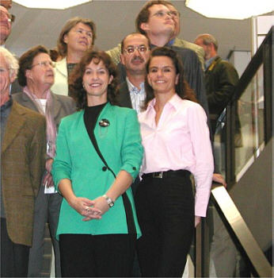

Unsere Trainerinnen und Vorstandsmitglieder Britta Lang und Suzana Manojlovic bekommen einen der Anerkennungspreise des Ehrenamtspreises der Kreissparkasse Böblingen.

Gestern wurde in Böblingen zum dritten Mal der Ehrenamtspreis der Kreissparkasse verliehen. Der Preis gliedert sich in 5 Ehrenamts- (1000 EUR) und 5 Anerkennungspreise (200 EUR), die eine Jury aus Vertretern der Sparkasse, der Stadt und des Sports unter den rund 80 Bewerbern vergeben hat.

Unsere Trainerinnen Britta Lang und Suzana Manojlovic erhielten einen der Anerkennungspreise für ihr weit über ihre Trainertätigkeit hinausgehedes Engagement im Bereich der Jugendarbeit unserer Jazztanzsparte. Die beiden zeigen jedes Jahr auf's neue in der Organisation der vielen Auftritte und vor allem unserer Jazztanzshow ihre Kreativität und Begeisterung für diese Tätigkeit.

Dafür vielen Dank und herzlichen Glückwunsch!

Autor: Michael Butschkau  
 24.09.2002

