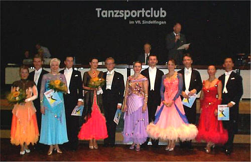
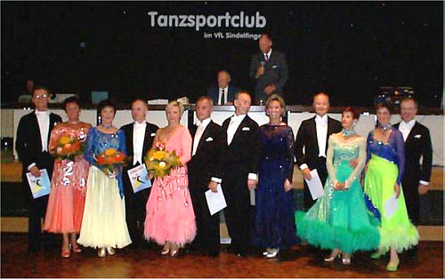
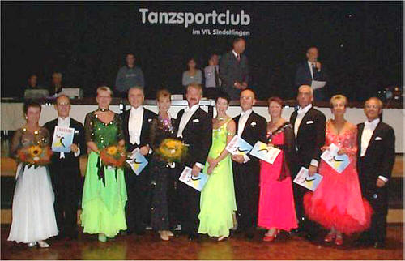

Das 75. Amateurtanzturnier war ein voller Erfolg. Einmal mehr hat sich gezeigt, dass sich unser traditionelles Herbstturnier grosser Beliebtheit erfreut.

Startfelder mit um die 20 Paare pro Klasse und Paare aus einem Einzugsgebiet von Leverkusen über München bis Basel sprechen diesbezüglich für sich.

Die Klassen Senioren I A und Senioren III A gingen ganz ohne sindelfinger Beteiligung -dafür aber nicht weniger erfolgreich- über die Bühne.

In der Klasse Senioren III S waren drei sindelfinger Paare am Start. Doch heute war die Konkurrenz zu stark, sodass auch die Endrunde dieser Klasse unter den weiter angereisten Paaren entschieden wurde.

Hier die Endrundenergebnisse der drei Turniere:

#### 

- 1. Jürgen+Katrin Kosch, ATC "Graf Zeppelin" Friedrichshafen
- 2. Andre Fellhauer - Gunda Maier, TC Konstanz
- 3. Janne-Artturi+Constanze Sartorius, TTC Rot-Gold Tübingen
- 4. Raymond+Martine Wiedemann, TSC Baden-Baden
- 5. Michael+Birgit Hess, TSZ Stuttgart-Feuerbach
- 6. Manfred+Hella Schnipper, TSA des TUS Griesheim

#### 

- 1. Jürgen+Ingrid Pöhner, TSC Gelb-Blau der DJK Unterbalbach
- 2. Alois+Angelika Bachmeier, TSC Neuwied
- 3. Manfred+Erika Land, TSA im TSV Schmiden
- 4. Walter+Viola Garant, 1.TSC Kichheim u.T.
- 5. Rainer+Christa Pfitzner, TSG Blau-Rot im TV Senden
- 6. Werner+Monique Conzelmann, 1.TSC Kirchheim u.T.

#### 

- 1. Horst+Waltraud Natter, TSC Savoy München
- 2. Jürgen+Veronika Riefler, TSC Staufer-Residenz Waiblingen
- 3. Peter+Yvonne Heinrich, DASA Sportgemeinschaft Ottobrunn
- 4. Gerhard+Borghild Delvendahl, Markgräfler TSC Müllheim
- 5. Alois Buchbauer - Gerda Berhalter, TSC Rot-Weiß-Öhringen
- 6. Karl-Eduard+Ursula Brückner, TSC Casino Royal Nürnberg

Autor: Michael Butschkau   
 06.10.2002

