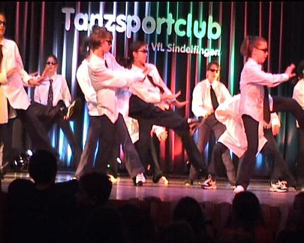

Lang war sie angekündigt und geplant und am Sonntag hat sie dann endlich stattgefunden: unsere Jazztanzshow "Hollywood". Wir hatten zwar schon mit reichlich Andrang gerecht doch die Realität hat uns diesmal einfach überrollt...

Bei ca. 280 vorwiegend jüngeren Tänzern war der Andrang von Eltern, Geschwistern, Verwandten und Bekannten größer als gedacht. Die 400 Stühle waren schnell gefüllt und auch Stehplätze wurden schnell rar. Doch all das war schnell vergessen als es dann tatsächlich losging.

Men in Black

Die Show war als Casting für ein Hollywood Musical konzipiert in dem der Regisseur und seine Sekretärin nach und nach die Gruppen auf ihre Bühnentauglichkeit prüften.

Die einzelnen Stücke waren jeweils bekannten Hollywood Filmen und Musicals entliehen und von Klassikern wie "West Side Story" und "Staying Alive" bis hin zu "SpaceJam" und "Mission Impossible" war alles vertreten.

Zur Einleitung gab es zu jedem Stück ein kleines Videointro, um dem ein oder anderen noch einmal das Thema in Erinnerung zu rufen.

Angespornt von den großen Vorbildern (und Trainern) haben alle Gruppen eine beeindruckende

Autor: Michael Butschkau  
 22.10.2002

