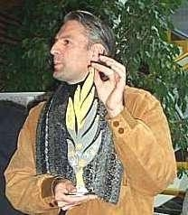

Am Samstag, 9. November 2002, wird erstmals der Sindelfinger Friedenspreis für Schüler und Schülerinnen verliehen. Der Preis wird vergeben für herausragende Projekte im Bereich der Friedensarbeit und Völkerverständigung.

Initiator H.G. Lang

Hinter zwei Geld- und Sachspendenprojekten hat die aus Schülern und Lehrern verschiedener Sindelfinger Schulen bestehende Jury unser Musikvideo gegen Gewalt "We don't care about that" auf den dritten Platz gewählt.

Die Preisverleihung wird Oberbürgermeister Bernd Vöhringer am 9.11. um 11.30 Uhr im Technischen Gymnasium der Gottlieb-Daimler-Schule I in der Neckarstraße 22 vornehmen.

Autor: Michael Butschkau  
 07.11.2002

