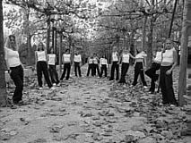
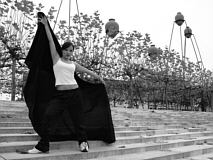
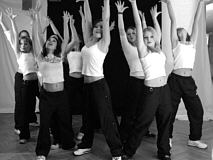
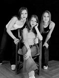

Kurz nach unserer Jazztanzshow (20.10.02) kam unsere Trainerin Britta Lang auf mich zu und fragte mich, ob wir denn mal ein Kalender-Fotoshooting machen könnte. Klar! Kein Problem! Wie? Noch vor Weihnachten? Aber auch das ging...

Ich finde es ja immer wieder nett, wenn man mit Dingen wie einem Fotoshooting auf mich zukommt und ich keinen blassen Schimmer von der Materie habe. Soviel Vertrauen ehrt mich. Klar, ich habe (wie jeder andere auch) schon mal Urlaubsbilder gemacht oder Schappschüsse auf irgendwelchen Veranstaltungen. Aber Bilder machen, die hinterher dazu taugen einen Kalender zu bestücken war dann doch eine andere Sache. Im Internet sind glücklicherweise viele Tipps und Tricks ambitionierterer Fotografen zu finden. Von der Show hatten wir noch zwei Standscheinwerfer, welche hinter einer Wand aus Papiertischdecke ein wunderbar weiches Licht erzeugten. Nun noch eine gute Digitalkamera geliehen und es konnte los gehen.

Am 10. November mittags war dann es dann soweit. Während ich die Technik für die Innenaufnahmen in unserem Trainingsraum aufbaute, war Britta fleißig dabei die 13 Mädels zwischen 12 und 16 Jahren zu schminken. Doch zunächst ging es dann raus in die Kälte. Solange noch genügend Licht da war haben wir Außenaufnahmen rund ums Böblinger Kongresszentrum gemacht. Und die Models waren froh, wenn sie sich nach jedem Bild wieder in ihre Jacken kuscheln durften. Spaß hatten wir und die Passanten aber trotzdem.

Danach gings dann rein in unser improvisiertes Studio. Zuerst versuchten wir Fotos der tanzenden Gruppe. Das war schwieriger als gedacht, denn die Auslöseverzögerung der Kamera war nicht berechenbar und das Licht für so kurze Belichtungszeiten dann doch zu schwach. Mit einzelnen Posen aus den Choreographien klappte das dann schon besser. Danach folgten noch jede Menge Einzel- und Gruppenportraits in denen sich die Gruppe dann auch zunehmend mit eigenen Ideen einbrachte.

Erst kurz vor der Tagesschau fand das Shooting sein Ende, doch die entstandenen Aufnahmen entschädigen für so einiges.

Nach 160 Seiten Fotopapier und vielen leeren Tintenpatronen waren dann auch die Bilder rechtzeitig vor Weihnachten in den Händen unserer Models.

Autor: Michael Butschkau  
 02.02.2003

