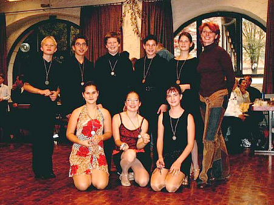

Seit Herbst 2001 trainiert Anita Pocz inzwischen fünf Paare im Alter von elf bis fünfzehn Jahren. Diese Gruppe ist eng zusammengewachsen und Trainingserfolge in den drei Tänzen (Cha-Cha, Rumba und Jive) sind immer deutlicher zu sehen.

  
Jugend in Heilbronn

So haben die Paare Jörg Blessing & Bianca Schmid, Reinhold Flemmer & Sabine Visi, Denny Herok & Piva Nolting sowie Sebastian Mentzel & Stephanie Knettenbrech ihre ersten Breitensportwettbewerbe in Heilbronn-Sontheim und Calw im Herbst 2002 bestritten. Bei diesen Wettbewerben dürfen Paare im Alter zwischen sechs und fünfzehn Jahren teilnehmen, die noch kein Turnier getanzt haben. Alle unsere Paare haben bei diesen ersten »Schnupperturnieren« erfolgreich abgeschnitten und machen durch ihren Ergeiz große Fortschritte.

Autor: Carmen Jawinsky  
 02.02.2003

