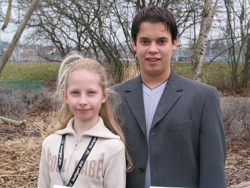

Heute fand im Spiegelsaal des Glaspalastes Sindelfingen die Ehrung der Sportler statt, die im letzten Jahr regionale, nationale und internationale Erfolge erzielt haben. Dabei auch unsere Landesmeister.

142 Sportler haben im letzten Jahr diverse Meistertitel in verschiedensten Sportarten nach Sindelfingen geholt. Stark vertreten waren dabei die Schwimmer, Judoka und Leichtathleten.

  
Landesmeister: Alexandra und Guiseppe

Eher als Exoten erschienen dabei unsere Landesmeister Guiseppe Mosello und Alexandra Ciosinski, die den Titel in der Klasse Junioren I C Latein errangen, in die B-Klasse aufstiegen und dort sofort auf den 3. Platz tanzten. Als Präsente erhielten die Sportler -je nach Größe des Erfolges- Urkunden, Poloshirts, Trinkflaschen, Bildbände und Ehrenmedallien aus den Händen von Oberbürgermeister Vöhringer und des Sportbürgermeisters.

  
Alexandra und Guiseppe mit OB Vöhringer 

Im Anschluß an den eineinhalbstündigen Ehrungsmarathon gab es dann noch die Möglichkeit sich bei Essen und Trinken zu Unterhalten bzw. sich näher mit dem Bogensport vertraut zu machen dessen deutsche Meisterschaften zeitgleich im Glaspalast stattfanden.

Autor: Michael Butschkau  
 15.03.2003

