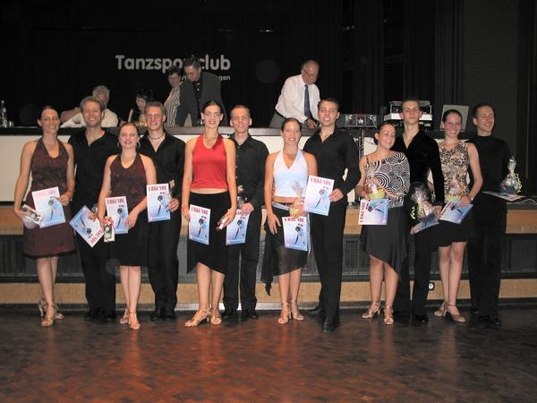

Gestern fand unser traditionelles Sommerturnier im Bürgerhaus Maichingen statt. Diesmal waren Tänzer und Tänzerinnen der Junioren und Hauptgruppen am Start. Unter den Junioren fanden sich auch drei sindelfinger Paare von denen sich zwei mit dem 3. und 4. Platz Endrundenplätze ertanzten.

Insgesamt war es eine erfolgreiche Veranstaltung auf der wir für die guten Wetterverhältnisse erstaunlich viele Zuschauer begrüssen durften. Für Stimmung war also gesorgt und die Paare sorgten dafür, dass dem Publikum auch was für's Auge geboten wurde.

Hier Bilder, Namen und Plazierungen der Endrundenteilnehmer.

#### 

- 1. Andreas Beckel - Sandra Wankmüller 1. TSC Schwarz-Rot Herrenberg
- 2. Kevin Nietsch - Svenja Zeitz TSC Royal Heilbronn
- 3. Yannick Will - Sarah Radajewski Schwarz-Weiß-Club Pforzheim
- 4. Dominik Rau - Pamela Rau TSC Rot-Weiß Öhringen
- 5. Achim Wankmüller - Laura Weiss 1. TSC Schwarz-Rot Herrenberg

#### 

- 1. Eugen Stein - Elena Rachinska TSZ Calw
- 2. Philipp Albrecht - Christine Münzer TSC Teningen
- 3. Reinhold Flemmer - Sabine Viel TSC im VfL Sindelfingen
- 4. Jörg Blessing - Bianca Schmid TSC im VfL Sindelfingen

#### 

- 1. Volker Berlenbach - Carla Debes TSC Schwarz-Gold Aschaffenburg
- 2. Daniel Reinhard - Caroline Bauer 1. TSC Schwarz-Rot Herrenberg
- 3. Emanuil Karakatsanis - Sarah Knapp TSA der TSG Weinheim
- 4. Peter Rustorfer - Anja Ruhstorfer Rot-Gold Ludwigsburg im TV Pflugfelden

#### 

- 1. Jan Joachim - Angela Rittersbacher TSA der TSG Weinheim
- 2./3. Sebastian Schetter - Silke Naumann TSC Blau-Gelb Backnang
- 2./3. Kai Safferling - Ramona Leitner TSA der TSG Weinheim
- 4. Steffen Raupp - Anja Bittner TSC Astoria Karlsruhe
- 5. Holger Fuchs - Martina Sach ATK Suebia Stuttgart
- 6. Eric Trösch - Katharina Bittner 1. TC Ludwigsburg

#### 

- 1. Thorsten Beigel - Ellen Suchezky TSC Grün-Gold Heidelberg
- 2. Andreas Bayer - Marie-Christine Klös TC Rot-Weiß Casino Mainz
- 3. Ulrich Meumann - Sabine Gaube TSC Astoria Karlsruhe
- 4. Maik Kobald - Iris Kauffmann-Hefner TSA der TG Biberach
- 5. Aksel Göhnermeier - Alexandra Pazidis TC Rot-Weiß Schwäbisch-Gmünd
- 6. Bernward Kett - Christine Kett ATK Suebia Stuttgart

Autor: Michael Butschkau  
 07.07.2003

