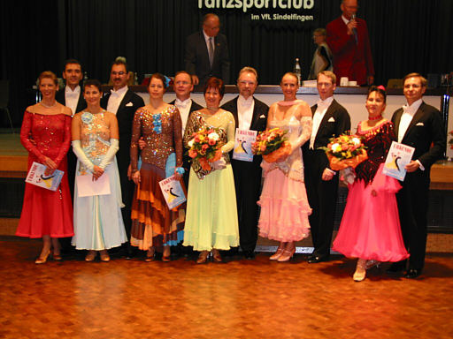
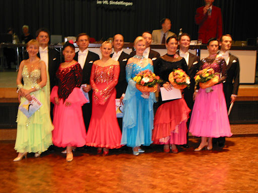
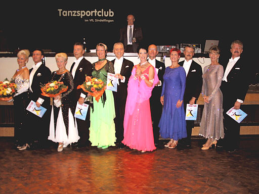

Am vergangenen Sonntag fand unser traditionelles Herbstturnier im Bürgerhaus Maichingen statt. Die Senioren das Tanzsports waren in drei Leistungs- und zwei Alterklassen am Start. Monika und Günther Lutz errangen für unseren Club einen ersten und einen fünften Platz.

Hier die Endrundenergebnisse im einzelnen:

 Endrunde Sen I B

- 1. Günther und Monika Lutz TSC im VfL Sindelfingen
- 2. Klaus Thrien - Andrea Pietschke TSC Astoria Stuttgart
- 3. Dieter Kühn - Inge Jotzo-Kühn TC Schwarz-Weiß-Club Esslingen
- 4. Dr. Rolf und Heike Hallstein TSC Gerstetten
- 5. Andreas und Jutta Walcher TSC Gerstetten
- 6. Manfred und Helen Zeck Der Bamber TC
- 7. Eduard und Renate Theil TC Neckartal Pleidelsheim

 Endrunde Sen I A

- 1. Uwe und Ursula Schreiber TSC Astoria Stuttgart
- 2. Rolf und Gabriela Plesshoff TSC Rot-Weiß Karlsruhe
- 3. Andreas und Carmen Herr TSC Teningen
- 4. Joachim und Marianne Dürr TSC Rot-Weiß Karlsruhe
- 5. Günther und Monika Lutz TSC im VfL Sindelfingen
- 6. Günter Müller - Christine Beckmann Markgräfler TSC Müllheim

#### 

- 1. Willi und Christa Bauer TSA Blau-Gelb Weiterstadt
- 2. Heinz und Margret Cierpka TC Schwarz-Weiß Reutlingen
- 3. Jürgen und Veronika Riefler TSC Staufer-Residenz Waiblingen
- 4. Gerhard und Borghild Delvendahl Markgräfler TSC Müllheim
- 5. Jürgen und Friederike Ensslin TSC Astoria Stuttgart
- 6. Peter und Yvonne Heinrich DASA Sportgemeinschaft Ottobrunn

Autor: Michael Butschkau  
 07.10.2003

