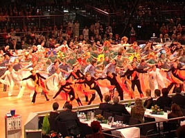
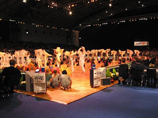
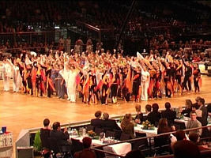

Knapp 150 unserer Jazztänzerinnen haben am vergangenen Samstag Abend den Auftakt der ARD Mastersgala -einem Turnier der weltbesten Amateure in Standard und Latein- gestaltet.

Begonnen hatte alles mit einem Auftritt einer unserer Jazztanzgruppen bei der jährlichen Fortbildungsveranstaltung für Tänzer und Trainer in Enzklösterle. Ein anwesender Organisator der Mastersgala war offensichtlich so begeistert, dass er anfragte, ob wir nicht Lust hätten den Auftakt der Mastersgala mit unseren Tänzerinnen zu gestalten.

Der Auftritt sollte allerdings die ganze Tanzfläche füllen und die ist bei einer solchen Veranstaltung entsprechend gross (20x25m). So wurde also ein abwechslungsreicher Tanz zum Thema "Elements" für 150 Tänzerinnen choreographiert.

Um 14 Uhr startete der Tross aus drei Reisebussen Richtung Karlsruhe. Bei unserer Ankunft gab's dann erstmal große Augen beim Organisator als unsere Tänzer aus den Bussen krabbelten. So viele hatte er dann wohl doch nicht erwartet.

Nach der kurzen Stellprobe war dann noch reichlich Zeit die anderen Akteure bei ihren Vorbereitungen zu beobachten. Doch um 19.45 Uhr war es dann soweit: es durfte getanzt werden! Und es wurde getanzt!! Die Menge an Tänzern und die fantasievollen Kostüme verschlugen die Zuschauer sofort in ihren Bann. Belohnt wurde der Auftritt mit reichlich Applaus.

Im Anschluß hatte alle noch reichlich Gelgenheit den Könnern im Standard- und Lateintanzen bei ihrem Turnier zuzusehen bevor es dann gegen 23 Uhr auf die Heimreise ging.

Alles in allem ein spannender Tag und ein erfolgreicher Auftritt vor großem Publikum. Als einziger Wehrmutstropfen bleibt zu erwähnen, dass die ARD leider nichts von unserem Auftritt in Ihrer Übertragung am Folgetag gezeigt hat.

Autor: Michael Butschkau  
 19.10.2003

