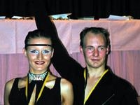

Die LM HGR II B LAT 2003 haben unser Paar, Bernd Wolf & Carmen Jawinsky, am 11. Oktober 2003 in Stuttgart-Untertürkheim gewonnen und sind damit auch in die A-Klasse aufgestiegen. Für diese Leistung wurde Ihnen der Ehrenpreis der Stadt Stuttgart überreicht.

Die mitgereisten Schlachtenbummler "alt & jung" sorgten für mächtig Stimmung und einer wunderbaren Kulisse im Saal. Nach diesem Erfolg wurde richtig gefeiert ... mit Sekt und Schnittchen ...

Wir bedanken uns recht herzlich für die Unterstützung aller!

Bernd & Carmen

Autor: Carmen Jawinsky  
 01.11.2003

