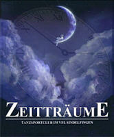

Am vergangenen Samstag (29.11.03) war es wieder soweit. Unsere diesjährige Jazztanzshow "Zeitträume" fand in der Stadthalle Sindelfingen statt. Die schon weit im Vorfeld ausverkaufte Veranstaltung hat regen Zuspruch gefunden.

 Die Geschichte war einfach: der kleine Bernd wird abends von seiner Mutter ins Bett geschickt und träumt sich unsortiert einmal quer durch die Menschheitsgeschichte. Und in jedem Zeitalter erwarteten ihn kleine und große Tänzer mit entsprechenden Tänzen, Kostümen und Kulissen. Von der Steinzeit bis hin ins 21. Jahrhundert war alles vertreten.

Die mehr als 1000 Zuschauer waren begeistert, bei unseren Kleinsten amüsiert, bei Stücken wie "Chicago" mit mehreren Gruppen völlig aus dem Häuschen. Mit der technischen Ausstattung der Stadthalle konnten wir in puncto Beleuchtung für uns neue Maßstäbe setzen. Mittels Videoprojektion wurde ein animiertes Bühnenbild realisiert.

Zum Schluß gab es noch den Auftritt unserer Gruppen bei der ARD Mastergala in Karlsruhe zu sehen, den die ARD aus Zeitgründen leider nicht gesendet hat.

So waren am Ende der Veranstaltung nur glückliche Gesichter zu sehen, bei Zuschauern und Mitwirkenden. Mit allen unseren Tänzern werden wir uns am 11.1.2004 (als kleine Entschädigung für alle Mühen) "Findet Nemo" im Kino ansehen.

Autor: Michael Butschkau  
 01.12.2003

