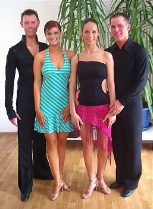

Über 700 Paare gingen am 1. und 2. Mai bei den Turnieren der TBW-Trophy-Serie im Bürgerzentrum in Karlsruhe an den Start. Auf drei Tanzflächen gleichzeitig wurden an diesem Wochenende die 40 Hauptklassenturniere in den Standard- und Lateintänzen abgewickelt. Mit dabei bei diesem Tanzmarathon waren die Paare Sandra Lazzarini mit Markus Feth und Anna Neff mit ihrem Partner Edwin Treiber vom Tanzsportclub im VfL Sindelfingen. Beide Paare machten mit guten Leistungen auf sich aufmerksam.

Anna Neff und Edwin Treiber tanzten in Karlsruhe ihr erstes gemeinsames Turnier. Schon nach einer verhältnismäßig kurzen gemeinsamen Trainingszeit war das Paar nicht zu übersehen.

In einem starken Feld konnte es überzeugen und an beiden Veranstaltungstagen in die Endrunden erreichen. Belohnung für das exzellente Tanzen war jeweils der zweite Platz. Sandra Lazzarini und Markus Feth fehlten vor dem Wochenende in Karlsruhe nur noch insgesamt 24 Punkte zum Aufstieg. Die ersten gemeinsamen Turniere tanzten sie Ende 2003. Von Anfang an waren die Beiden ganz vorne mit dabei. Schon der erste Start brachte die erste Aufstiegsplatzierung. Und so ging es weiter, jeder Start eine weitere Platzierung. Zum Punkte sammeln war die TBW-Trophy natürlich ideal, da hier in der Regel große Startfelder angesagt sind.

Ganz souverän zeigten Sandra und Markus an beiden Tagen ihr Können. Am ersten Tag hatten Sandra und Markus die Nase vorn und belegten den ersten Platz. Jetzt fehlten nur noch vier Pünktchen zum Aufstieg in die C-Klasse. Die wollten Sandra und Markus sich natürlich am zweiten Tag sichern. Dabei gab es keinerlei Schwierigkeiten. Wieder qualifizierten sie sich sicher für die Endrunde. Mit dem vierten Platz waren die fehlenden Punkte gesammelt und der Aufstieg konnte gefeiert werden.

Anschließend gingen die beiden natürlich auch noch in der C-Klasse an den Start. Auch hier wurden die guten Leistungen des Paares anerkannt. Sandra und Markus konnte hier immerhin fast die Hälfte der Konkurrenz hinter sich lassen.

Autor: Christine Richter  
 06.05.2004

