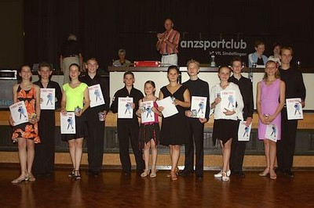
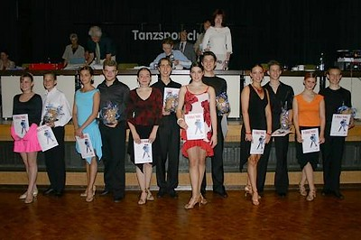
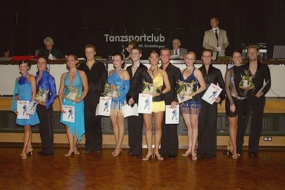
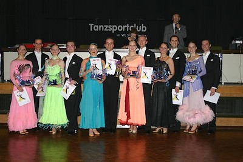

Am Sonntag fand unser traditionelles Sommerturnier im Bürgerhaus Maichingen statt. Diesmal waren wieder Tänzer und Tänzerinnen der Junioren, Jugend und Hauptgruppen am Start. Alle angetretenen Sindelfinger Paare erreichten Endrundenplätze!

Markus und Sandra Insgesamt war es eine erfolgreiche Veranstaltung auf der wir für die guten Wetterverhältnisse erstaunlich viele Zuschauer begrüssen durften. Für Stimmung war also gesorgt und die Paare sorgten dafür, dass dem Publikum auch was für's Auge geboten wurde.

#### 

- 1. Nicolas Petker - Julia Kuschner TSC Grün-Gold Heidelberg
- 2. Marcus Fritsch - Sandra Nietsch TSC Royal Heilbronn
- 3. Domenico Franzo - Jessica Eisenkrein TSZ Calw
- 4. Reinhold Flemmer - Sabine Visi TSC im VfL Sindelfingen
- 5. Andreas Spannagel - Erika Bernhardt ATC Blau-Gold in der TSG 1845 Heilbronn
- 6. Sven Batram - Lilia Görlitz TSC Astoria Tübingen

#### 

- 1. David Kinsky - Manon Schweinfurth TSG Freiburg
- 2. Tobias Scherer - Jaqueline Stadler TSC Landau
- 3. Alexander Dippel - Christina Dippel Regio TC Freiburg
- 4. Jonathan Kan - Lena Flamm Regio TC Freiburg
- 5. Alexander Glass - Anna-Sophia Ehleiter TSA d. TSG 1846 Backnang
- 6. Dominic Kossina - Jenny Steinhauer TSC im VfL Sindelfingen

#### 

- 1. Tiziano Molinari - Olga Gudaew TC Rot-Weiß Schwäbisch-Gmünd
- 2. Felix-Sebastian Petersen - Carolin Peikert TSG Freiburg
- 3. Ralf Lambertz - Doreen Passehl TSC Rot-Weiß Böblingen
- 4. Markus Feth - Sandra Lazzarini TSC im VfL Sindelfingen
- 5. Adrien Emrich - Kirsten Meyer TC Rot-Weiß Casino Mainz
- 6. Eric Trösch - Katharina Bittner 1. TC Ludwigsburg

#### 

- 1. Kai Fleischer - Jana Blaschke TTC Rot-Gold Tübingen
- 2. Danny Herrmann - Sonja Herrmann TSC Rot-Weiß Öhringen
- 3. Christian Schauer - Veronika Knott TSC Rondo im TSV Haar
- 4. Jarek Dudek - Julia Patzelt TSC Schwarz-Weiß Reutlingen
- 5. Marius Pflüger - Sabine Heinrich TSZ Stuttgart-Feuerbach
- 6. Dieter Meister - Anja Petzold TTC Rot-Gold Tübingen

Autor: Michael Butschkau  
 07.07.2004

