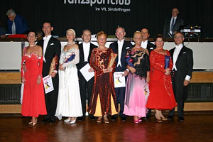

Am vergangenen Sonntag fand wieder unser jährliches Herbstturnier im Bürgerhaus Maichingen statt. In allen Alters- und Leistungsklassen waren unsere Paare am Start und konnten in allen Turnieren Endrundenplätze belegen.

Hier die Endrundenergebnisse im einzelnen:

#### 

- 1. Frank und Sabine Komarek TSC Blau-Gold Casino Mannhein
- 2. Carsten Wiethaupt und Petra Rudy TSC Rot-Weiß Öhringen
- 3. Oliver Schaich und Monika Rothenfußer Tanzsport-Zentrum Augsburg
- 4. Bernd Wolf und Carmen Jawinsky TSC im VfL Sindelfingen
- 5. Klaus Thrien und Andrea Pietschke TSC Astoria Stuttgart
- 6. Viktor und Nelli Laukart TSC Residenz Ludwigsburg

#### 

- 1. Robert und Manuela Keller Weiß-Blau-Casino Memmingen
- 2. Klaus Thrien und Andrea Pietschke TSC Astoria Stuttgart
- 3. Arnold und Susanne Feichtinger VTSC Casino Dornbirn
- 4. Dieter Kühn - Inge Jotzo-Kühn TC Schwarz-Weiß-Club Esslingen
- 5. Viktor und Nelli Laukart TSC Residenz Ludwigsburg
- 6. Günther und Monika Lutz TSC im VfL Sindelfingen

#### 

- 1. Klaus und Irene Kast ATK Suebia Stuttgart
- 2. Gerhard und Monika Winkler TSC im VfL Sindelfingen
- 3. Horst und Rosmarie Kessel TSC im VfL Sindelfingen
- 4. Gilbert und Monique Erb TSC Schwarz-Weiß Offenburg
- 5. Pasquale und Trudel D'Allesandro TSC im VfL Sindelfingen

#### 

- 1. Heinz und Margret Cierpka TC Schwarz-Weiß Reutlingen
- 2. Horst und Waltraut Natter TSC Savoy München
- 3. Gero und Magarita Heere TSV Kronshagen
- 4. Gilbert und Monique Erb TSC Schwarz-Weiß Offenburg
- 5. Horst und Rosmarie Kessel TSC im VfL Sindelfingen
- 6. Karl Eduard und Ursula Brückner TSC Rot-Gold-Casino Nürnberg

Autor: Michael Butschkau  
 Veröffentlichungsdatum: 13.10.2004

