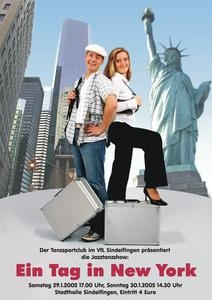

Es ist wieder soweit: nachdem wir unsere Tänzer und Tänzerinnen in 2004 nicht in einer kompletten Show präsentiert haben, lassen wir sie nun wieder los. Ende Januar werden wir an zwei Tagen die Bühne der Sindelfinger Stadthalle mit rund 300 Aktiven fluten.

Jazztanzshow 2005 Und obwohl wir dieses mal zwei Tage mit je 1000 Sitzplätzen bieten können gibt es für beide Tage nur noch geringe Zahlen an Restkarten.

Die Shows beginnen am 29.1.2005 um 17 Uhr und am 30.1.2005 um 14.30 Uhr. Der Eintritt kostet 4 Euro.

Mit dem Thema "Ein Tag in New York" ist genügend Raum für einen bunten Querschnitt durch tänzerische und musikalische Stilrichtungen gegeben. Genaueres wird noch nicht verraten... ;-)

09.01.2005

Michael Butschkau

