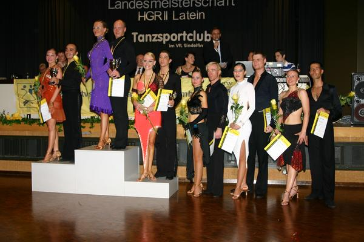

Am vergangenen Samstag (18. Juni 2005) richtete der TSC im VfL Sindelfingen die Landesmeisterschaft HGR II D-S Latein aus.

Unser Paar Bernd Wolf und Carmen Jawinsky wurden Landesmeister in der A-Klasse und sind damit in die S-Klasse aufgestiegen.

  
 Endrunde A-Latein

Allgemein fand die Veranstaltung im Bürgerhaus Maichingen positiven Anklang.Das Bürgerhaus war festlich herausgeputzt, die Bewirtung mit Kuchen, Brötchen, Getränken sicher gestellt und als Gastgeschenk bekamen alle Paare Bilderrahmen, die sie während der Veranstaltung kostenlos mit Fotos von sich füllen lassen konnten.

Autor: Michael Butschkau, 20.06.2005

