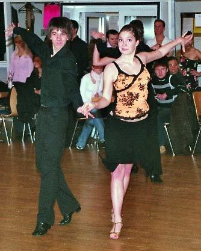

In Karlsruhe und Siegelsbach wurden die Landesmeisterschaften der Jugend und der Senioren I ausgetragen. Mit dabei waren insgesamt vier Paare des TSC im VfL Sindelfingen. Und das natürlich mit Erfolg.

In der Startklasse Jugend D-Latein waren Bianca Schmid und Dominic Kossina sowie Piva Nolting und Denny Herok mit dabei. In einem riesigen Starterfeld zeigten beide Paare ganz tolle Leistungen. Wegen der ungeheuren Leistungsdichte konnten beide Paare aber nicht die Treppchenplätze erreichen.

 Aufgestiegen: Piva Nolting und Denny Herok Piva Nolting und Denny Herok hatten vor dieser Landesmeisterschaft ganz kurz vor dem Aufstieg in die C-Klasse gestanden. Dieses Ziel erreichte das Paar ganz locker. Beim anschließenden Start in der neuen - höheren - Startklasse machten die beiden ihre Sache noch einmal sehr gut und sammelten als Anschlusspaar zum Semifinale gleich eine ganze Menge Aufstiegspunkte.

Auch bei den Senioren gingen zwei Paare des TSC im Vfl Sindelfingen an den Start. In der C-Klasse tanzten Marion Brummer und Markus Frey ihr allererstes gemeinsames Turnier. Trotz anfänglicher Nervosität lieferten die beiden eine ganz tolle Leistung ab und waren im Finale mit dabei. Hier gaben Marion Brummer und Markus Frey dann noch einmal alles und erreichten am Ende einen ganz tollen sechsten Platz.

In der A-Klasse zeigten dann Rita und Thorsten Petersmann ihr Können. Sicher und gekonnt brachten sie die fünf Standardtänze auf das Parkett. Nachdem der Aufstieg in diese schon sehr hohe Leistungsklasse noch nicht gar so lange her war, freuten sich Rita und Thorsten Petersmann sehr darüber, dass sie bis ins Semifinale vorstoßen konnten.

Autor: Christine RichterVeröffentlichungsdatum: 24.02.2006

