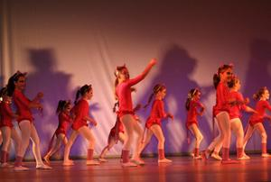
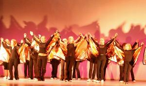
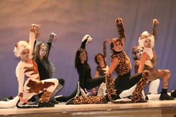
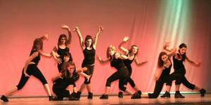

### 

? war das Motto der Tanzshow des TSC im VfL Sindelfingen in derStadthalle. In der an beiden Tagen komplett ausverkauften Stadthallekonnten die Zuschauer miterleben, wie Moderator Günther Schlauch(Michel Duprey) seine Kandidaten Gertrud Müller (SylviaBrückner-Lorenz) und Karl Otter (Bernd Wolf) genau so gekonnt wie indem aus dem Fernsehen bekannten Show befragte.Unterstützt wurde er dabei durch die rund 350 Kinder und Jugendlichen,die die Fragen und auch die Werbung tänzerisch ausgesprochen gekonntdarstellten. Die Musikauswahl traf dabei sicherlich auch jedenGeschmack.

### 

Die kleinen rosaroten Panther (Kinder 6) pirschten zur allseitsbekannten Melodie Bühne. Die Kindergruppe 3 zeigte, dass sich auch A‘s,B‘s, C‘s und D‘s durchaus elegant bewegen können.  

### 

Für die Kandidatin Gertrude Müller kam das Aus schon mit der zweitenFrage. Die Kindergruppe 0 schickte sie mit der Melodie "Spiel mir dasLied vom Tod" von der Bühne. Anschließend tanzten sie folgerichtig zu"The Show must go on".Eine ganze Gruppe Mozarts (Kinder 5) und Osterhasen (Kinder 7) zeigten,worum es in den ersten beiden Fragen für den neuen Kandidaten KarlOtter ging.

### 

Danach stand die erste Werbepause an. Für die Beantwortung der nächstenFrage benötigte Karl Otter dann auch schon den Publikumsjoker, der vonder Jugendgruppe 9 und jeweils einem A, B, C und D zum Titel "Ibelieve" vertanzt wurde.Die nächste Frage rankte sich um Musik der Gruppen Whigfield, Destiny‘sChild, Jamilia und Black Eyed Peas. Durch die richtige Beantwortungarbeitete sich Karl Otter immer näher an die Milliarde heran. Damithatte sich dann auch das Publikum eine Pause verdient. Stärken konnteman sich hier mit hausgemachtem Kuchen, Kaffee und anderen Getränken.

### 

 Nach der Pause ging erst einmal wieder in eine Werbeunterbrechung, dievon der Turniergruppe Latein getanzt wurde.Auch die nächste Frage brachte den Kandidaten nicht aus dem Konzept.Zwar musste er den 50:50-Joker zu Hilfe nehmen, um sich zwischen Sariund Sarong entscheiden zu können. Die Kindergruppen 4 (Titel "I like tomove it") und 2 (Titel "Lecha Lecha") halfen ihm, die richtigeEntscheidung zu treffen.  
  

### 

Mit der steigenden Gewinnsumme wurden die Fragen natürlich auch immerschwieriger. Dabei ging es um Agentenfilme, Groschenromane undMusicalmusiken. Die tänzerische Darstellung der Agenten (Jugend 6)führte ohne Umweg zur richtigen Antwort. Groschenromane gehörten nicht wirklich Karl Otters Wissensgebieten. DerTelefonjoker musste her. Dieser fühlte sich wohl schon vernachlässigt. Zur Musik "Kein Schwein ruft mich an" kam die Jugendgruppe 5 zu ihrem Auftritt und stellte sehr gekonnt "Zorro" zu "Der Fluch von Capristo"dar. Nach der richtigen Antwort ging es dann mit Musicalmusiken weiter. Britta Land und Suzana Manojlovic schwebten zu "Elisabeth" durch dasBild.

"Cats" wurde gekonnt dargestellt von der Jugendgruppe 2 und denErwachsenen. Hier wuselten fellige Gestalten durch Publikum und überdie Bühne.  
Als Antwort standen auch noch der "Tanz der Vampire" (Jugend 3 und 4)und "Jesus Christ Superstar" (Jugend 1) zur Auswahl.Auch hier traf der Kandidat ins Schwarze und stand damit vor derletzten Frage.

### 

Für die Beantwortung dieser alles entscheidenden Frage braucht KarlOtter schon eine ganze Menge Bedenkzeit. Diese wird ausgefüllt von derWettkampfgruppe Jazztanz.  

Zwar kam der Kandidat der Antwort immer näher. Fing auch schon einmalan, sich auszumalen, was man mit dem Gewinn so alles anstellen könnte. Hilfestellung gaben ihm schließlich Tänzerinnen aus mehreren Gruppen. Der Jubel war groß, als auch noch die letzte Frage richtig beantwortetwurde.. Günther Schlauch wollte dann natürlich wissen, was Karl Ottermit seinem riesigen Gewinn denn nur wirklich planen würde. Gedachtwurde dabei an die Mutter, die eine Geschirrspülmaschine erhaltensollt. Natürlich sollte eine Villa, eine Yacht und eine Weltreise her.Die Jazztanzrainerinnen Britta Lang, Suzana Manojlovic, SylviaBrückner-Lorenz, Claudia Bentele, Maren Reichel, Birgit Dawidoswki undOlivia Pede brachten Aber alle Träume ganz schnell zum Platzen.Der Koffer mit dem Gewinn wurde überreicht, geöffnet und der Schreckwar groß. Im Koffer waren nur jede Menge kleine Schokoladentafeln. Dergeschockte Kandidat konnte es gar nicht fassen. Moderator GüntherSchlauch machte ihm allerdings ganz schnell klar, dass nie über dieWährung, in der der Gewinn ausgezahlt werden sollte, gesprochen wordenwar. Schnell erholte sich Karl Otter wieder und erwies sich als guterVerlierer. Er teilte die Schokolade ganz großzügig mit allen Zuschauernund Mitwirkenden.

Insgesamt war es wieder eine ganz großartige Show. Der Aufwand, den derTSC mit Trainerinnen, Mitwirkenden und Helfern betrieben hat, um dasMammutprogramm auf die Bühnen zu stellen hat sich gelohnt. DieJazztanztrainerinnen und die Lateintrainerin Anita Pocz haben in Monatelanger Arbeit zusammen mit den Mitwirkenden möglich gemacht, dass allemusikalichen und künstlerischen Ideen mit großer Perfektionin Szene gesetzt werden konnten. Dazu gehörte natürlich auch jede Mengelogistischer Aufwand, dass alle 350 Kinder, Jugendlichen undErwachsenen zur richtigen Zeit am richtigen Ort waren.Ohne die vielen ehrenamtlichen Helfer und Helferinnen und dem Stadthallenteam wäre dies alles nicht möglich gewesen. Daher gilt der Dank der Trainerinnen und des TSC ganz besonders diesen Helferinnen und Helfern im Hintergrund.

Natürlich gilt der Dank auch den Sponsoren Hotel Marriott, der Löwenund der Central Apotheke und dem Möbelhaus GAMMA für ihre finanzielleUnterstützung. Der Kreissparkasse Böblingen gilt ganz großer Dank, dassalle Mitwirkenden zur Belohnung für ihre Mühe wieder einen gemeinsamenKinobesuch im Filmzentrum machen können. Von dieser Stelle noch einmal ein ganz, ganz herzlicher Dank an alle,die durch ihre Hilfe dieses Mammutprojekt erst möglich gemacht haben.

Autor: Christine Richter

Veröffentlichungsdatum: 28.03.2007

[weitere Bilder](show-2006.html)

