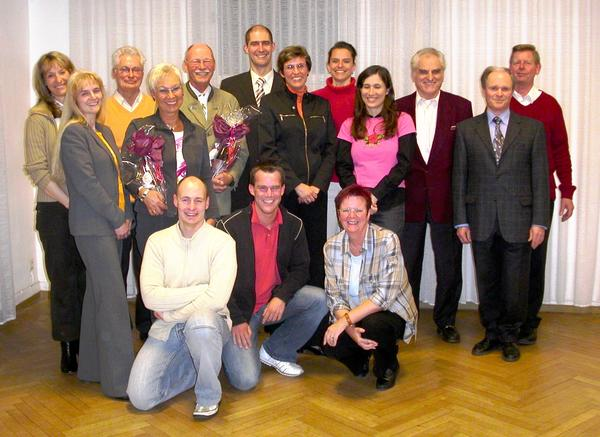

Der TSC im VfL Sindelfingen kann wiederum auf ein erfolgreiches Jahr zurückblicken. Stetiges Wachstum, tolle Veranstaltungen, sportliche Erfolge, zukunftsorientierte Investitionen und solide Finanzen waren das Fazit des Jahres 2005.

Dies wurde aus den Berichten der Abteilungsleitung bei der Jugend- und auch der anschließenden Mitgliederversammlung ganz deutlich. Im sportlichen Bereich konnte wieder über viele Erfolge im In- und Ausland, Landesmeistertitel und Aufstiege in die nächsthöheren Leistungsklassen berichtet werden. Besonders erwähnenswert ist hier sicherlich der Gewinn der Landesmeisterschaft durch das TSC-Paar Carmen und Bernd Wolf in der A-Latein Klasse.

Höhepunkte bei den Veranstaltungen waren sicherlich die große Jazztanzshow im Januar 2005 mit 300 Mitwirkenden, bei der die Stadthalle Sindelfingen an beiden Veranstaltungstagen komplett ausverkauft war und die im Bürgerhaus Maichingen ausgetragenen Landesmeisterschaften der Hauptklassen D- bis S-Latein.

Der in 2004 gestartete Ausbau des Trainingszentrums konnte erfolgreich abgeschlossen werden. Eingeweiht wurde das 'neue' Trainingszentrum im Rahmen eines Balles kurz vor Weihnachten. Man war sich einig, die vielen Arbeitsstunden der Clubmitglieder und der hohe finanzielle Aufwand haben sich gelohnt, denn im Trainingszentrum beim VfL Vereinsheim stehen nun zwei große Säle mit über 300 qm Tanzfläche zur Verfügung. Kennzeichnend für den TSC im VfL Sindelfingen ist auch, dass trotz der sich verschlechternden wirtschaftlichen Lage, die Mitgliederzahl auch im Jahr 2005 wieder gestiegen ist. Mit über 500 Mitgliedern konnte ein neuer Höchststand seit bestehen des Tanzsportclubs verzeichnet werden.

Trotz größerer Investitionen konnte das Jahr mit einem positiven Kassenergebnis abgeschlossen werden. Die Kassenprüfer bescheinigten eine solide finanzielle Basis des Tanzsportclubs. So konnte der Abteilungsleitung die vom Geschäftsführer des VfL Herrn Medinger beantragte Entlastung erteilt werden. Danach gingen die turnusmäßigen Neuwahlen problemlos über die Bühne. Alle Kandidaten wurden jeweils einstimmig gewählt. Der alten und neuen Abteilungsleiter ist Klaus Richter.

Zwei stellvertretende Clubleiter werden in Zukunft das Clubleitungsteam verstärken, Bernd Wolf (Breitensport) und Carsten Lorenz (Öffentlichkeitsarbeit). Zur Nachfolgerin von Klaus Hamann (Kasse) wurde Suzana Manojlovic gewählt. Markus Feth blieb weiterhin als Stellvertreter im Team. Die Mitgliederverwaltung und den Beitragseinzug liegt weiterhin in den Händen von Klaus Arndt und seinem Vertreter Alfred Schmidt. Die sportliche Ebene bedienen weiterhin Sportwartin Carmen Wolf und Vertreter Rolf Zimmer. Presse und Öffentlichkeitsarbeit werden von Christine Richter und Michael Butschkau (Webmaster) geleitet. Die Verantwortlichen für den Jugendbereich waren bereits im Rahmen der Jugendversammlung gewählt worden. So konnten während der Mitgliederversammlung Jugendwartin Sylvia Brückner-Lorenz, ihre Stellvertreterin Claudia Bentele, Jugendsprecherin Maren Reichel und die Jazzbeauftragte Britta Lang bestätigt werden. Die beiden Kassenprüfer Herbert Schöllmann und Alfred Keicher und die Veranstaltungswartin Ingrid Bauer vervollständigen ein großes Team, zu dem auch noch Stefan Dietl (Gebäudemanagement) und die Koordinatoren der Gruppensprecher Rosmarie und Horst Kessel gehören. Die Aufzählung der vielen Namen weist auf ein großes Team hin. Dies hat sich aber in den letzten Jahren bewährt und ist für die über 500 Mitglieder des TSC inzwischen auch nötig. Die Zusammenarbeit vieler ist Garant für den Erfolg der Abteilung.

In einem kurzen Ausblick auf die geplanten Veranstaltungen im Jahr 2006 wurde auf die neue Jazzshow Anfang Oktober (wieder anzwei Tagen in der Stadthalle Sindelfingen ) und das Turnier im Bürgerhaus Maichingen im Juni hingewiesen. Außerdem werden noch viele kleinere Events stattfinden. Zum Schluss der Versammlung konnte Abteilungsleiter Klaus Richter sich dann noch mit einem kleinen Geschenk bei Hannelore und Hartmut Brede sowie Gudrun und Eckart Läufer für dreißig Jahre Mitgliedschaft bedanken.

Bild: - stehend von links nach rechts: Suzana Manojlovic, Ingrid Bauer, Rolf Zimmer, Gudrun Läufer, Eckhard Läufer, Carsten Lorenz, Sylvia Brückner-Lorenz, Britta Lang,Claudia Bentele, Adolf Keicher, Herbert Schöllmann, Klaus Richter

- unten von links nach rechts: Bernd Wolf, Markus Feth, Christine Richter

Autor: Klaus Richter; Veröffentlichungsdatum: 06.04.2006 

