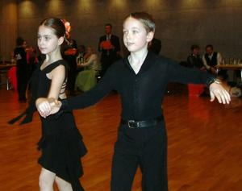

Thorsten Petersmann kam als Zuschauer und ging begeistert nachHause. Und diese Begeisterung hält bis heute an. Dabei war eseigentlich nur sein Wunsch, auch einmal in der Frackklasse zu tanzen.

Ihre Tanzsportkarriere starteten Rita und Thorsten Petersmann beimbenachbarten Herrenberger Tanzsportclub. Im Frühjahr 2004 entschiedensich die beiden dann, nach Sindelfingen zu wechseln. Zu diesemZeitpunkt waren sie schon bis in die B-Klasse bei den Senioren I (ab 35Jahre) vorgestoßen.

### 

Fleißiges Training und eiserne Disziplin brachte dann auch rechtschnell die erforderlichen ersten bis dritten Plätze und Punkte für denAufstieg in die A-Klasse ein.Der Sprung in die Frackklasse im letzten Jahr geschafft. Dasursprünglich angestrebte Ziel war damit erreicht.Das war aber kein Grund, mit dem Tanzen aufzuhören. Die höchsteStartklasse S wurde ab sofort angepeilt. Mittlerweile haben Rita undThorsten Petersmann in der bereits ausgesprochen leistungsstarkenKlasse viele der notwendigen 250 Punkte und der insgesamt zehn erstenbis dritten Plätze ertanzt.

Rita und Thorsten Petersmann

Am 10. März fuhren Rita und Thorsten Petersmann nach Mannheim zurLandesmeisterschaft 2007 nach Mannheim. Vom ersten Tanz an zeigten sieihre Ambitionen auf einen der vorderen Plätze. In dem großenStarterfeld machten sie eine gute Figur und erreichten sicher dasSemifinale. Hier konnten sie aber leider zwei der siebenWertungsrichter nicht mehr voll und ganz von sich überzeugen. Am Endemussten sie sich mit dem wirklich undankbaren siebten Platz zufriedengeben.

### 

Aber nicht nur die Eltern Petersmann sind begeisterte Tanzsportler.Auch der noch nicht ganz 10-jährige Sohn Marc hat sich seine erstenSporen auf dem Parkett bereits verdient.Mit seiner Partnerin Vanessa Weiß startete Marc Petersmann die eigeneTanzsportkarriere in der Startklasse Kinder D-Latein gleich nach denSommerferien im letzten Jahr.

### 

Von Turnier zu Turnier wuchs das Selbstvertrauen des jungen Paares.Und damit natürlich auch die Routine. Im Januar 2007 ertanzte sich dasjüngste aktive Paar des TSC im VfL Sindelfingen mit dem ersten Platz inFreiberg am Neckar die erste Aufstiegsplatzierung.

Mark und Vanessa

Am 10. Februar war dann in Heilbronn-Sontheim dieLandesmeisterschaft angesetzt. Hier tanzten Vanessa Weiß und MarcPetersmann ihr siebtes gemeinsames Turnier. Angetreten waren insgesamtzwölf Paare. Schon vor dem Turnier hatte Marc gesagt, dass Vanessa under auf jeden Fall die Endrunde erreichen würden. Und das taten diebeiden dann auch ganz souverän. Am Ende verpassten Vanessa Weiß undMarc Petersmann mit dem vierten Platz ganz knapp den Sprung auf dasTreppchen.

Autor: Christine Richter

Veröffentlichungsdatum: 28.03.2007

