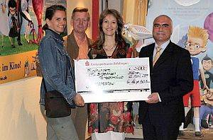

Endlich wurde der Kinogutschein für die Kinder und Jugendlichen des TSC im VfLSindelfingen eingelöst.

Er war die Belohnung für die grandiose Tanzshow im Oktober 2006 inderStadthalle Sindelfingen. Jetzt gab es einen für allemöglichen Termin und auch einen Film, der für alle Altersgruppen, also von sechs Jahres aufwärts, zugelassen war. Rund 250 Kinder, Jugendliche,Trainerinnenund Abteilungsleiter Klaus Richter besuchten das Bärenkino in Böblingenund schauten sich das Leben und Treiben der "Familie Robinson" an.

 Gesponsert wurdedieser Kinobesuch von der Kreissparkasse in Sindelfingen. Im Namen der Kreissparkasse überreichte Herr Günther Reichert vor Filmbeginn einen großzügigenScheck.Dieser wurdestellvertretend fürden TSC im VfL Sindelfingen von Klaus Richter und den beidenTrainerinnen Britta Lang und Suzana Manojlovic entgegengenommen.

Bild von links nach rechts:Britta Lang, Klaus Richter, Suzana Manojlovic, GüntherReichert

28.5.2007  
Christine Richter

