Auch 2007 war der TSC wieder stark auf dem Internationalen Straßenfest vertreten. Sowohl am Samstag, den 16. als auch am Sonntag, den 17. Juni waren jeweils rund 120 Kinder und Jugendliche auf den einzelnen Bühnen mit dabei.

Trotz des übervollen Programms hatte der TSC mit je zwei Mal 30 Minuten Auftrittszeiten an beiden Tagen noch einen großen Brocken abbekommen. Die Zuschauerresonanz war an beiden Tagen sowohl an der Hauptbühne als auch an den kleineren Bühnen groß. Der TSC ist mit seinen Tänzern und Tänzerinnen im Laufe der Jahre mit Sicherheit zu einem festen Bestandteil des Straßenfestes geworden.

Christine Richter  
27.6.2007

[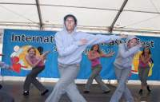](files/vfl/2007/07061601.jpg)

[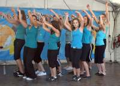](files/vfl/2007/07061602.jpg)

[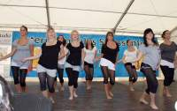](files/vfl/2007/07061604.jpg)

[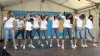](files/vfl/2007/07061605.jpg)

[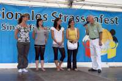](files/vfl/2007/07061606.jpg)

[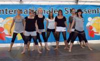](files/vfl/2007/07061607.jpg)

[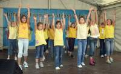](files/vfl/2007/07061608.jpg)

[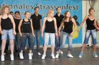](files/vfl/2007/07061609.jpg)

[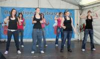](files/vfl/2007/07061610.jpg)

[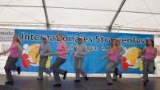](files/vfl/2007/07061611.jpg)

[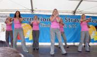](files/vfl/2007/07061612.jpg)

