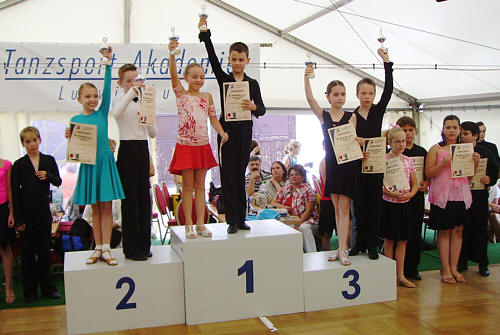

Vanessa Weiß und Marc Petersmann aus Bondorf gehen mit Elan und Begeisterungin der Startklasse Kinder D-Latein (also 10 Jahre alt) an den Start.Und das mit großem Erfolg.

Zuletzt hielten die beiden in Ludwigsburg an zweiTagen hintereinander die Farben des TSC im VfL Sindelfingen ganz hoch.An beiden Tagen erreichten Vanessa Weiß und Marc Petersmann ganz sicher dieEndrunden.

Am ersten Tag waren sie ein ganz bisschen enttäuscht, dass der fünfte Platz ihnen nicht die ersehnte vorletzte Aufstiegsplatzierung brachte. Am zweiten Tag drehten sie im Finale noch einmal richtig auf. Vanessa Weiß und Marc Petersmann überzeugten durch ihre tolle Leistung. Belohnt wurden sie mit dem dritten Platz, einer Urkunde und einem Pokal Jetzt fehlt nur noch eine Platzierung für den Aufstieg in die C-Klasse.

Christine Richter  
18.07.2007

