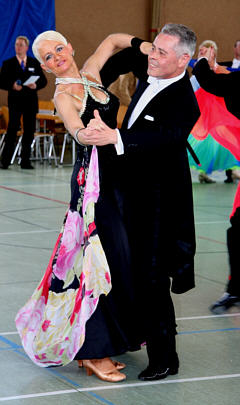

Erfolgreiche Teilnahme der Paare des TSC im VfL Sindelfingen bei den Landesmeisterschaften der Hauptgruppe und der Senioren in Sinsheim am 8.9. und 9.9.2007.

Mit dabei waren Anke Ludwig und Markus Frey in der Hauptgruppe C. Nach einer erfolgreichen Generalprobe in Wiesbaden mit einem tollen zweiten Platz gingen die beiden voller Selbstvertrauen an den Start. Vom ersten Tanz an machten Anke Ludwig und Markus Frey klar, dass sie in der Endrunde ein Wörtchen mitreden wollten. Dies gelang ihnen auch durch stielsicheres und überzeugendes Tanzen. In der Endrunde gingen die Wertungen wild durcheinander, da die Leistungen sehr gleichwertig waren. Alle sechs Paare erhielten gute und schlechte Noten. Zwar standen Anke Ludwig und Markus Frey am Ende nicht auf dem Siegerpodest, konnten mit dem fünften Platz aber zufrieden sein.

Monika und Gerhard Winkler traten bei den Senioren in der höchsten Startklasse S an. Auch dieses Paar war gut vorbereitet. Wie immer tanzten sie musikalisch und trotzdem ausgesprochen sportlich durch alle Runden bis ins Finale. Hier waren noch sieben Paare mit dabei. Noch einmal zeigten Monika und Gerhard Winkler ihr ganzes Können und erreichten schließlich den siebten Platz.

Christine Richter  
12.9.2007

