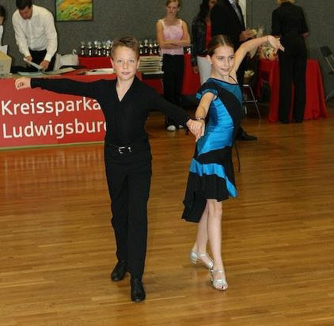

Für den ersten ganz großen Triumph ihrer gemeinsamen Tanzsportkarriere hatten sich Vanessa Weiß und Marc Petersmann (Bondorf) den Kastanienpokal des 1. TC Ludwigsburg ausgesucht. Beide sind erst neun Jahre alt und damit das jüngste Turnierpaar des TSC im VfL Sindelfingen. Das insgesamt elfte Turnier sollte den Aufstieg in die C-Klasse bringen.

Von Anfang an waren Vanessa Weiß und Marc Petersmann in der Startklasse Kinder D-Latein erfolgreich. Fleißig sammelten sie in ihren ersten zehn Turnieren Punkte und Platzierungen. Die Punkte hatten sie alle beieinander, es fehlte nur noch ein Platz unter den ersten vier. Beide hatten den Ehrgeiz nicht nur mit einem vierten Platz aufzusteigen. Nach Möglichkeit wollten sie das Turnier auch gewinnen.

Sicher kamen sie in die Endrunde. Die Wertungen für den ersten Tanz, den Chachacha, waren noch sehr gemischt. In der Rumba war es dann ganz sicher der zweite Platz. Im Jive drehten Vanessa Weiß und Mark Petersmann noch einmal richtig auf, was auch mit dem ersten Platz in diesem Tanz belohnt wurde. Am Ende stand das junge Paar auf dem zweiten Treppchenplatz. Der Aufstieg in die C-Klasse war gesichert. Trotzdem waren Vanessa Weiß und Marc Petersmann ein klein wenig enttäuscht, weil es nur für das Siegerpaar einen Pokal gab.

Christine Richter  
10.10.2007

