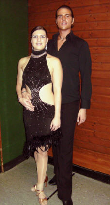

Beim Latein-Turnier der Staufer Residenz Waiblingen ging das HGR C-Paar Katrin Ruder und Wolfgang Reyser an den Start.   
Von Beginn an dominierten sie das Feld von 13 Paaren und zeigten in der Vorrunde wie auch in der Zwischenrunde einwandfreies Tanzen.   
In der Endrunde verpasste das Paar trotz guter Ausstrahlung und sportlichen Tanzens nur knapp den ersten Platz, konnte aber auf seinen zweiten Platz in einer mit starken Paaren besetzten Endrunde stolz sein.

Anna Neff  
11.12.2007

