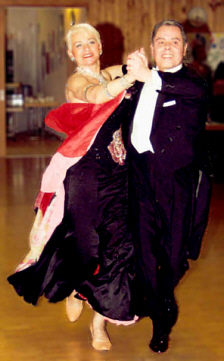

Bei der TBW Trophy in Neu-Ulm und den Sinsheimer Tanzsporttagen starteten unsere Paare Elena Posadino und Walter Gattler,sowie Monika und Gerhard Winkler in das Neue Jahr.

#### 

Elena Posadino und Walter Gattler nahmen gleich an den ersten Wochenende der TBW-Trophy in Neu-Ulm teil. In der Hauptgruppe II B-Latein zeigten die Beiden eine großartige Leistung bei beiden hochklassig und mit vielen Paaren besetzten Startfeldern. Am Samstag erreichten Elena Posadino und Walter Gattler das Semi- und am Sonntag das Viertelfinale.

#### 

Monika und Gerhard Winkler gingen in Sinsheim an den Start. In Senioren III S machten sie klar, dass sie zu den Besten Paaren dieser Startklasse gehören. Am ersten Tag verpassten sie mit dem vierten Platz ganz knapp das Siegerpodest. Der zweite Tag lief dann noch besser. Für ihr sportliches und trotzdem musikalisches Tanzen wurden Monika und Gerhard Winkler mit dem zweiten Platz belohnt.

Christine Richter  
14.01.2008

