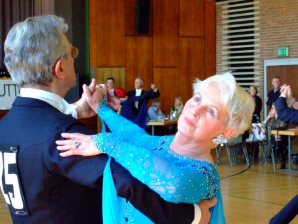
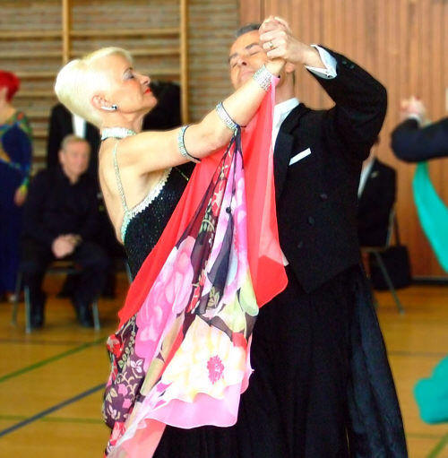

Am 2.2.2008 starteten zwei unsere Senioren S Paare in Stuttgart Botnang.Angesetzt waren Sen IV S und Sen III S Standard, sowie Sen C Latein und Sen S Latein.Leider mussten die Lateinturniere wegen fehlender Meldungen abgesagt werden.Dafür waren bei den Senioren IV S Standard dreizehn Paare am Start und bei den Senioren III S starteten 11 Paare.

#### 

Im ersten Turnier Sen IV S startete unser Paar Regina und Henry Freude.Die Turnhalle in Botnang war gut besucht und es waren genügend Schlachtenbummler des VfL dabei. Leider kam unser Paar nur bis zur 1. Zwischenrunde.

#### 

Im nachfolgendem Senioren III S Turnier startete das Paar Monika und Gerhard Winklerfü unseren Club. Trotz aller Anstrengung waren die ersten Plätze schon vergeben an die Paare Kast vom ATK Suebia, dem Paar Cierpka vom TC Schwarz-Weiss Reutlingen unddem PaarDürr vom Schwarz-Weiss Club Pforzheim. Unser Paar Winkler belegte somit den vierten Platz.

B. Peter  
03.2.2008

