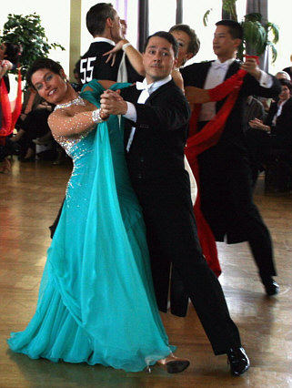

Am Samstag, den 16. Februar 2008 geht es im Bürgerhaus Maichingen hoch her. Der TSC im VfL Sindelfingen richtet die Baden-Württembergischen Landesmeisterschaften für die Senioren Latein und die Senioren I Standard aus.

Am Start sind insgesamt rund 70 Paare aus dem ganzen Bundesland. Zu bewundern ist an diesem Tag von der niedrigsten bis zur höchsten Leistungsklasse alles war Rang und Namen hat.

Vom TSC im VfL Sindelfingen mit dabei sind zwei Paare mit Aussicht auf Plätze auf dem Siegerpodest. In Senioren B-Latein gehen Elena Posadino und Walter Gattler an den Start. Rita und Thorsten Petersmann (siehe Foto) sind bei den Senioren I A-Standard mit dabei.

Veranstaltungsbeginn ist 12:15 Uhr, der Eintritt kostet 3,00 €. Zuschauer - auch Nichttänzer - sind herzlich willkommen.Bemerkung: Senioren D Latein wurde wegen zu geringer Beteiligung abgesagt.

Christine Richter  
 14.02.2008

