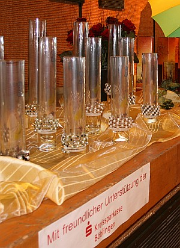

Am 16. Februar 2008 war im Bürgerhaus Maichingen volles Haus. Der TSC im VfL Sindelfingen richtete hier die Landesmeisterschaften der Senioren Latein und der Senioren I Standard aus.

In den sieben einzelnen Startklassen gingen insgesamt 65 Paare an den Start. Begleitet und angefeuert wurden die Paare von vielen Schlachtenbummlern und ihren Trainern.

Gut beschirmt geht es in die Landesmeisterschaft.

Das Turnier Senioren D Latein musste wegen zu geringer Beteiligung abgesagt werden.

#### 

Den Anfang machten die Lateiner mit der C-Klasse. Landesmeister wurden hier Gabriele Dinius und Andreas Grom vom TTC Rot-Gold Tübingen vor Simone und Dr. Jochen Straßner (TSC Sybilla Ettlingen) und Ariane und Joe Trieblnig (TSA d. TSG 1862 Weinheim).

#### 

In der B-Klasse gingen Elena Posadino und Walter Gattler vom TSC im VfL Sindelfingen voll motiviert an den Start. Sie überzeugten durch eine wirklich gute Leistung und ertanzten sich die Silbermedaille. Sieger hier wurden die gerade aufgestiegenen C-Meister Gabriele Dinius und Andreas Grom. Bettina und Jürgen Ehret von der TSA der TSG 1862 Weinheim sicherten sich die Bronzemedaille.

#### 

Bei den Senioren Latein gibt es keine A-Klasse. Es ging dann gleich mit der höchsten Leistungsklasse S weiter. Die Goldmedaille holten sich Claudia und Michael Sawang, die ebenfalls für die Weinheimer Tanzsportabteilung starten. Silber ging Bettina Sterr und Michael Honig von der TSG Freiburg, Bronze an Eva Furch-Gritzner und Harald Gritzner von der TSA d. SV Alemannia 08 Müllheim. Dann nahmen die Standardpaare ihren Wettkampf auf.

#### 

Landesmeister der Senioren I D wurden Kerstin und Alexander Ebert (TSC Aalener Spion)vor Marion Hohl und Andreas Gropp (TSC Rot-Gold Sinsheim) und Birgit und Rolf Koppenhöfer (TSA d. TSG 1846 Backnang.

#### 

Klare Sieger in der C-Klasse wurden Corinna und Morris Fröhlich vom TSC Rot-Weiß Tauberbischofsheim vor Dagmar Krüger und Thomas Lange vom TSC Kurpfalz Brühl. Die D-Meister Katrin und Alexander Ebert sicherten sich mit Bronze ihre zweite Medaille an diesem Tag.

#### 

Mit jeder Klasse steigerten sich die Leistungen immer mehr. Landesmeister der B-Klasse wurden Andrea und Jochen Schneider (TSA d. SSV Ulm 1846) vor Jeannette Graf und Stephan Brömmel (TSC Kurpfalz Brühl) und Carolin und Christof Stewen (TSC Illingen).

#### 

In der A-Klasse meldeten dann auch die Bondorfer Rita und Thorsten Petersmann vom TSC im VfL Sindelfingen ihren Anspruch auf die vorderen Plätze an. Das Paar tanzte sich sportlich durch die ersten beiden Runden und kam ganz sicher ins Finale. Hier zeigte sich dann die Leistungsdichte in dieser Startklasse. Die Wertungen lagen ganz dicht beieinander. Am Ende belegten Rita und Thorsten Petersmann den sechsten Platz. Gold gewannen Sabine und Oliver Landler vom TSC Schwarz-Weiß Ochsenhausen. Silber ging an Susanne und Helmut Hüls (TSC Staufer-Residenz Waiblingen) und Bronze an Annette und Dieter Kuchenbecker vom TC Schwarz-Weiß Reutlingen.

Die Medaillen und die Urkunden für alle Endrundenteilnehmer kamen natürlich von Tanzsportverband Baden-Württemberg.

Die Pokale - zusammengesetzt aus einer Glasvase und einem Armreifen - wurden gesponsert von der Kreissparkasse Böblingen. Übergeben wurden diese Pokale vom Filialleiter der Kreissparkasse in Maichingen Robert Binder.

Die Armreifen wurden entworfen und hergestellt von dem TSC-Mitglied Monika Winkler (CreaSchmuck).

Von der Allgemeinen Ortskrankenkasse in Sindelfingen wurden die Turnierpaare mit Obst und Getränke an einer Sportlerbar versorgt.

Abschließend kann der TSC im VfL Sindelfingen auf eine schöne und erfolgreiche Veranstaltung zurückblicken.

Christine Richter  
17.02.2008

#### 

