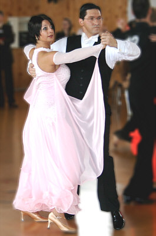

Anke Ludwig und Markus Frey aus Gäufelden machten sich auf den Weg nach Frankfurt, um dort in der Startklasse Hauptgruppe II C-Standard an den Start zu gehen.

Die für den Aufstieg in die B-Klasse Platzierungen - nämlich fünf mal der erste bis fünfte Rang - haben die beiden schon lange beisammen. Schwieriger ist es, die notwendigen 150 Aufstiegspunkte zu sammeln. Kleine Startfelder machen weite Wege erforderlich, da es für jedes geschlagene Paar nur einen Punkt, maximal 20 Punkte pro Turnier gibt.

In Frankfurt stritten immerhin neun Paare und Plätze und Punkte. Das tanzbegeisterte Publikum und die Paare feuerten sich gegenseitig zu Höchstleistungen an. Ganz sicher erreichten Anke Ludwig und Markus Frey die Endrunde.

Voll motiviert und durch tolle Musik inspiriert drehten die beiden noch einmal voll auf. Die Leistungen der sechs Finalisten lagen eng bei einander. Den Wertungsrichtern wurde die Entscheidung dadurch sehr schwer gemacht. Am Ende war nur der erste Platz eindeutig. Von Platz zwei bis sechs konnte jedes Paar jeden Platz erreicht haben.

Um so glücklicher waren Anke Ludwig und Markus Frey, dass sie den zweiten Platz und sieben Punkte ertanzt hatten. Der Weg nach Frankfurt hatte sich also auf jeden Fall gelohnt.

Christine Richter  
25.02.2008

