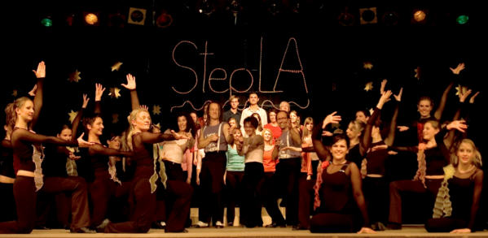

Die Steptanzgruppen vom TSC Sindelfingen im VfL Sindelfingen und vom SV Rohrau beteiligen sich an zwei abendfüllenden Kulturveranstaltungen des Vereins: "Kunst & Kultur in LA" e.V..

Nach einigen Veranstaltungen in Baden-Württemberg präsentieren sich verschiedene Kunstgruppen des Vereins mit steppenden, tanzenden, musizierenden und singenden Akteuren. Besonders hervorzuheben sind dabei die selbst inszenierten, komponierten und choreographierten Beiträge. Die Projektgruppe der bildenden Künste bereichert das Bühnenbild mit handgemachten Kunstgegenständen.

Genießen Sie diese Shows in der Alten Kelter in Bietigheim-Bissingen am 26.April 08 um 17:00 oder 20:00 Uhr, dargeboten von Laien mit professionellem Anspruch.  
Weitere Informationen und Inspirationen finden sie unter: [http://www.stepinla.de](http://www.stepinla.de/)

  
  
Kartenvorverkauf:  
"Koffer & Tasche", Schieringerstr.2, 74321 Bietigheim-Bissingen (Fußgängerzone)   
oder unter der oben genannten Internetadresse,sowie Tel. 0172 / 8194088.

Steptanzinteressierte sind jederzeit willkommen, um in Sindelfingen oder Rohrau regelmäßigen Unterricht zu besuchen.

Anfänger- und Mittelstufenkurse in Sindelfingen: (Discokeller, VfL Sindelfingen, Rudolf-Harbig-Straße 15)Donnerstags 17 Uhr bis 18:15 Uhr  
Fortgeschrittenenkurs in Sindelfingen:Donnerstags 20:15 Uhr bis 21:30 Uhr

Mittelstufenkurs in Rohrau: (Schönbuchhalle)Donnerstags 18:45 Uhr bis 20:00 Uhr

Geleitet werden diese Kurse von Marita Unsner und Kai Kresse, die seit mehr als 10 Jahren über 80 Steptanzbegeisterte unterrichten. Ihre Erfahrungen auf der Bühne und im Unterricht haben sie bereits mit vielen prominenten Gästen, wie auch bei nationalen und internationalen Meisterschaften unter Beweis stellen können.

25.03.2008

