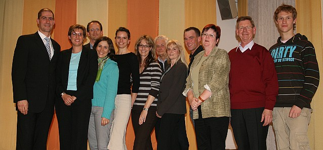

Am Freitag, den 11.04.2008 traf man sich beim TSC im VfL Sindelfingen zur Jugend- und Mitgliederversammlung.

Aus dem Bericht des Clubleiters Klaus Richter ging ganz deutlich hervor, dass der Tanzsportclub zwar auf ein schwieriges, aber dennoch erfolgreiches Jahr 2007 zurückblicken kann. Schwierig war das Jahr, da insgesamt sechs Trainerinnen im Laufe des Jahres durch Krankheit, Mutterschutz, Auslandsstudium und Arbeit im Ausland ausfielen. Aber die Lösung wurde durch Vertretungen aus den eigenen Reihen bravourös gelöst.

Der Mitgliederstand (ca. 500) wurde trotzdem gehalten. Das spricht für die Akzeptanz aller Vertretungen innerhalb der betroffenen Gruppen. Sportliche Erfolge und Aufstiege in nächsthöhere Klassen konnten in allen Leistungsklassen im In- und Ausland verzeichnet werden.

Finanziell steht der TSC im VfL Sindelfingen weiterhin auf sicheren Füßen. Die Kassenprüfer hatten nichts zu beanstanden, sodass der als Vertreter des Hauptvereins anwesende Christian Michel die Entlastungen durchführen konnte.

Das wichtigste Thema des Tages waren dann allerdings die turnusmäßigen Neuwahlen des gesamten Vorstandes. Fest stand, dass vier Posten neu besetzt werden mussten. Die übrigen Mitglieder des recht großen Vorstandteams standen wieder zur Wahl. Nicht mehr für ihre Posten kandidierten der bisherige Abteilungsleiter Klaus Richter, sein Vertreter Bernd Wolf und Sportwartin Carmen Wolf. Nach der Geburt von Sohn Marvin legt das Ehepaar Wolf eine Familienpause ein.

Die Wahlen gingen alle problemlos - wie immer beim TSC - über die Bühne. Abteilungsleiter ist jetzt der bisherige Vertreter Carsten Lorenz. Ihm zur Seite stehen als Vertreter Klaus Richter und Ingrid Bauer. Zum Sportwart wurde Walter Gattler gewählt. Zum Sportwartteam gehören außerdem Rolf Zimmer und Thorsten Petersmann. Im Kassenteam (Suzana Manojlovic und Markus Feth, Klaus Arndt und Alfred Schmidt - zuständig für die Mitgliederverwaltung - und die Kassenprüfer Herbert Schöllmann und Alfred Keicher) und bei der Presse (Christine Richter und Web-Master Bernd Peter) gab es keine Veränderungen. Im Presseteam werden künftig auch Petra Mornhinweg und Anja Westerhoff mitarbeiten. Das Jugendwartteam war vorher schon im der Jugendversammlung gewählt worden. Die Mitgliederversammlung bestätigte Jugendwartin Sylvia Brückner-Lorenz, Vertreterin Claudia Bentele, Jugendsprecherin Maren Reichel und ihren neu dazugekommenen Vertreter Christian Hirning sowie die Jazzbeauftragte Britta Lang im Amt.

Vor der Durchführung der Wahlen wurde Klaus Richter sowohl von den Mitgliedern des TSC als auch von den Trainerinnen nach zehn Jahren Amtszeit mit Geschenken verabschiedet. Der Ehrenvorsitzende Dieter Kühneweg blickte in einer Laudatio auf diese Zeit zurück. Zum Abschluss der Versammlung konnten auch noch langjährige Mitglieder des TSC im VfL Sindelfingen geehrt werden. Für 25 Jahre Mitgliedschaft erhielten Erika und Manfred Röckle die silberne Ehrennadel des VfL. Dazu kam noch ein Geschenk des TSC. Ein Geschenk des TSC erhielten Gertrud und Roland Kocher sowie Elisabeth und Klaus Hamann für 30 Jahre im TSC im VfL Sindelfingen.

Nach getaner Arbeit kann sich der TSC aufeine gemeinsame Wanderung und ein Sommerfest freuen. Gespannt kann man auch auf die nächste große Tanzshow in der Stadthalle Sindelfingen sein. Die Termine 7. und 8. Februar 2009 stehen schon fest.

Von links nach rechts zusehen: Carsten Lorenz, Sylvia Brückner-Lorenz, Christian Michel, Claudia Bentele, Britta Lang, Suzana Manojlovic, Rolf Zimmer, Ingrid Bauer, Markus Feth, Christine und Klaus Richter, Christian Hirning

Christine Richter  
 17.04.2008

