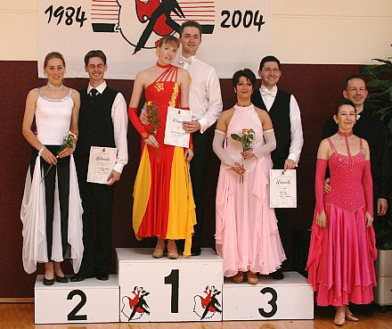

Zwei Paare des TSC im VfL Sindelfingen erreichten Treppchenplätze.

#### 

Anke Ludwig und Markus Frey mussten dafür praktisch „nur um die Ecke“. Beim Nachbarverein 1. TSC Schwarz-Rot Herrenberg gingen die Beiden in der Hauptgruppe II C an den Start. In letzter Zeit hatte das Paar durch das musikalische und ausgeglichene Tanzen immer das Finale gebucht. So auch wieder in Herrenberg. Anke Ludwig und Markus Frey zeigten eine tolle Leistung und ertanzten sich den dritten Platz.

#### 

Elena Posadino und Walter Gattler mussten für ihren Erfolg wesentlich weiter fahren. In München ging es im den Bayern-Pokal. Seit das Paar sich für den Wechsel von der Hauptgruppe in die Startklasse Senioren B-Latein entschieden hat, tanzt es immer ganz vorne mit. Natürlich auch in München. Von Anfang an machten Elena Posadino und Walter Gattler klar, dass sie ganz große Ambitionen hatten. Ihr technisch sauberes und Ausdruck starkes Tanzen brachte ihnen am Ende den zweiten Platz ein.

Christine Richter  
28.04.2008

