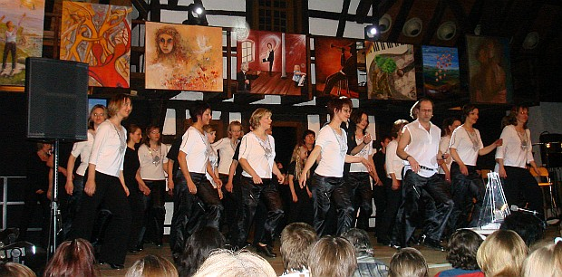

Nach vielen Auftritten und abendfüllenden Shows im gesamten Süden präsentiert sich der Verein „Kunst & Kultur in LA“ zum aktuellen Tournee-Ende am 31.05. und 01.06.2008 in der Westerheimer Albhalle.

Am Samstagabend führt er alt Bewährtes in neuer Besetzung und neu entwickelte Projekte u.a. mit Live-Musik auf. Das Programm umfasst steppende, tanzende, singende und musizierende Akteure mit ihren neu inszenierten, selbst komponierten und einstudierten Beiträgen. Mit dabei sind steppende sowie singende Gäste aus Sindelfingen, Rohrau und Vereinsmitglieder aus Bietigheim. Die Projektgruppe der bildenden Künste wird das „Bühnenbild“ mit handgemachten „Kunstgegenständen“ bereichern. Nach erfolgreicher Teilnahme an nationalen und internationalen Wettbewerben wird „Kunst & Kultur in LA“ auf der „42nd Street in LA“ beginnen und beim Worldcup in Riesa enden. Genießen Sie diesen Abend, dargeboten von Laien mit professionellem Anspruch.

Das Programm läuft am Samstag bzw. Sonntag wie folgt ab:  
„Kunst & Kultur in LA“ e.V.  
Projektgruppen: Tanz & Gesang – bildende, mediale & darstellende KünsteAusstellungs- & Infostände

31.05.2008- 14:00hBilderausstellung mit Live-MalereiEintritt frei- 15.30hFilm im KuschelkinoEintritt 0,50€- 20h2std. BühnenshowEintritt 10€, erm. 8€- 22.30hFilm im KuschelkinoEintritt 2€Barbetrieb01.06.08:- 11hBrunchEintritt 15€- 10h-14hBilderausstellung mit Live-Malerei- 12hDiashow im Kuschelkino- 14hBilderversteigerung zu Gunsten St. Stephanus- 16hEnde der Präsentationstage

An beiden Tagen ist für das leibliche Wohl der Gäste gesorgt! Weitere Inspirationen und Informationen finden Sie unter www.stepinla.de, unter www.kukuinla.de ,Tel. 0172/8194088 oder unter 07333/7644

Vorverkauf:  
 - Raumausstattung Wiedmann, Laichinger Str.1, Westerheim  
- Papeterie Stäudle, Marktplatz 5, Laichingen  
- www.stepinla.de oder Tel. 0172 / 8194088

Christine Richter  
13.05.2008

