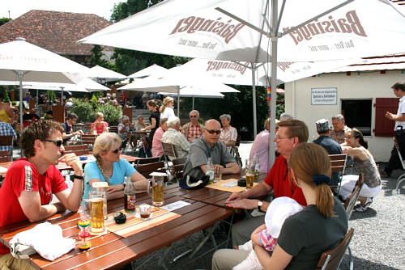

Am 1. Juni 2008 traf sich eine zwar kleine – aber dafür engagierte – Truppe des TSC zur Wanderung im Schönbuch.

Treffpunkt war ein Parkplatz bei Entringen. Nach den Unwettern der beiden vorangegangenen Tage freuten sich alle über den strahlend blauen Himmel und den Sonnenschein. Allerdings hatte der starke Regen einige Wege in Schlammlöcher verwandelt, die den eigentlichen Weg unpassierbar machten. Aber die Wanderführer Ingrid Bauer und Stefan Dietl hatten natürlich eine Ausweichroute parat.

So machte sich das Grüppchen auf den etwas verkürzten Weg zum Schloss Hohenentringen. Hier traf die hungrigen und durstigen Wanderer auf den Nachwuchs Amelie mit Mama Suzi Manojlovic und Papa Ralph Köster.

Natürlich hatten sich Ingrid und Stefan auch wieder ein kleines Ratespiel ausgedacht. Das Gewicht des Inhalts eines schön verpackten Päckchens musste geraten werden. Die Auflösung erfolgte nach dem Essen. Am besten schätzten drei weiblich Mitglieder der Gruppe. Karla Kühnel und Gertrud Kocher lagen schon recht dicht am richtigen Ergebnis. Aber den Vogel schoss Christine Richter ab, die nur wenige Gramm zu viel angegeben hatte. Dafür konnte sie dann ein Stück Schwarzwälder Schinken mit nach Hause nehmen.

Nach einer ausgiebigen Pause machte man sich dann wieder auf den Weg zurück zum Parkplatz. Wieder einmal hatten die Tänzer gezeigt, dass sie auch viele fröhliche Stunden ohne Sport miteinander verbringen können.

Christine Richter  
 09.06.2008

