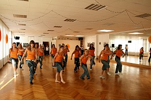
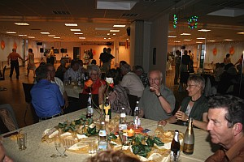

Die Mitglieder des TSC im VfL Sindelfingen bringen nicht nur sportlich Höchstleistungen. Sie können auch feiern.

Am 28. Juni 2008 traf man sich im Trainings-Zentrum zum Sommerfest. Geboten war gutes Essen, tolle Programmpunkte, mit alten und neuen Bekannte ein Schwätzchen halten und natürlich auch ein wenig tanzen.

Die musikalische Begleitung kam von Heidrun Dolde, die für jeden Geschmack den richtigen Ton und Takt fand. Auf dem Programm standen Darbietungen der Jazztanzgruppen von Britta Land und Suzana Manojlovic.

Außerdem legten Monika und Gerhard Winkler mit einem Überblick über die Standardtänze eine flotte Sohle auf das Parkett.

Für das leibliche Wohl war ausreichend gesorgt. Für Essen und Getränke sorgte der Tanzsportclub. Das Dessertbuffett wurde von den Mitgliedern bestückt. Bis weit nach Mitternacht wurde das Tanzbein geschwungen und auch gemütlich beieinander gesessen. Sicherlich war dieses Sommerfest ein schöner Abend für die Mitglieder.

[Weitere Bilder hier](sommerfest-2008.html)

Christine Richter  
 01.07.2008

