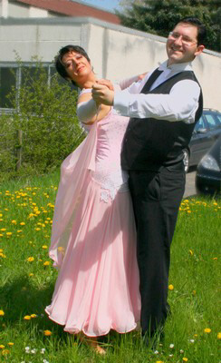

Die Paare des TSC im VfL Sindelfingen waren wieder auf der ganzen Linie erfolgreich. Tollen Sport boten sowohl Paare aus dem Breitensport- als auch aus dem Leistungssportbereich.

#### 

Ingrid Bauer und Stefan Dietl und Ingrid und Bernd Peter gingen beim Breitensportwettbewerb in Waiblingen an den Start. Diese Wettbewerbe werden von vielen Paaren als Sprungbrett in den Leistungsport genutzt. Daher werden auch in diesem Bereich – in der Regel Mannschaftswettbewerbe - gute Leistungen gebracht. Die beiden Sindelfinger Paare bildeten zusammen mit Natalija und Jakow Rajtschik vom Schwarz-Weiß-Club Pforzheim eine Mannschaft. Alle drei Paare zeigten so gute Leistung, dass die Mannschaft mit einem riesigen Vorsprung von 17 Punkten den ersten Platz von sieben Mannschaften (28 Paare) belegte. In der Einzelwertung lag das Ehepaar Rajtschik ganz vorn. Knapp dahinter belegten Ingrid Bauer und Stefan Dietl den zweiten Platz. Ingrid und Bernd Peter ordneten sich im vorderen Mittelfeld ein.

#### 

In Tübingen fanden die Tübinger-Tanzsport-Tage für die Hauptklassen Latein und Standard statt. Auch hier waren zwei Paare des TSC im VfL Sindelfingen mit dabei. Elena Posadino und Walter Gattler traten an beiden Tagen in der Hauptgruppe II B-Latein an. Wie immer zeigten die beiden exaktes, technisch sauberes und überaus musikalisches Tanzen. So erreichten sie natürlich an beiden Tagen die Finalrunden. Am Samstag standen Elena Posadino und Walter Gattler als Dritte mit auf dem Treppchen. Am Sonntag war es der fünfte Platz.   
  

Anke Ludwig und Markus Frey fanden wurden vor gut zwei Jahren ein Tanzpaar. In der Startgruppe Hauptklasse II C-Standard waren sie von Anfang an vorne mit dabei. Eine lange Verletzungspause von Anke Ludwig konnte den Erfolg des Paares nicht stoppen. Eigentlich tanzten sie bei allen gemeinsamen Turnieren bis ins Finale, so auch bei den Landesmeisterschaften.

Nur die immer recht kleinen Startfelder verhinderten einen früheren Aufstieg in die B-Klasse, für den 150 Punkte (1 Punkte je geschlagenes Paar) notwendig sind. Zu den Tübinger-Tanzsport-Tagen fuhren Anke Ludwig und Markus Frey mit der Gewissheit, die letzten neun Punkte zu ergattern. Die erforderlichen fünf Platzierungen (Platz 1 bis 5) hatten sie längst eingesammelt. Selbstbewusst und wie immer musikalisch und technisch ausgereift schwebten die beiden über das Parkett. Kleine Startfelder verhinderten den Aufstieg bereits am ersten Tag. Der Doppelstart in der Hauptgruppe I und II brachte nur acht Punkte. Und dass, obwohl das Paar in der Hauptgruppe II den dritten Platz belegten. Am zweiten Tag stand nach dem Erreichen der Endrunde der Aufstieg bereits fest. Trotzdem zeigten Anke Ludwig und Markus Frey noch einmal ihr ganzes Können. Mit dem sechsten Platz war der Aufstieg in die B-Klasse sicher erreicht.

Leider war dieses Turnier das letzte gemeinsame dieses erfolgreichen Paares. Sicherlich werden sowohl Anke Ludwig als auch Markus Frey mit ihren jeweiligen neuen Partnern auf der Erfolgsleiter weiter nach oben schwingen.

Christine Richter  
 22.07.2008

