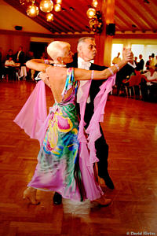

  
Ehepaar Winkler  
Foto von David Kiefer

Monika und Gerhard Winkler nahmen ein ganz normales Turnier in Enzklösterle als Aufwärmtraining für die weltgrößte Turnierveranstaltung German Open Championchips in Stuttgart.

In Enzklösterle tanzte das Ehepaar bis ins Finale und belegte den fünften Platz bei 25 gestarteten Paaren. Das Ziel bei der GOC war in der eigentlichen Startklasse Senioren III S unter die besten 50 zu kommen. Dieses Ziel wurde fast erreicht. Am Ende war es der 58. Platz von 130 Paaren.

Bei den jüngeren Senioren II S waren 201 Paare am Start. Hier peilten Monika und Gerhard Winkler die zweite Runde an. Der Verlust eines Schuhs stellte aber ein klares Handicap dar. 132 erreichten die zweite Runde. Winklers belegten den 133.

Rita und Thorsten Petersmann maßen sich in der Startklasse Senioren II A. Die beiden zeigten eine durchweg gute Leistung, konnten aber auch über einen Platz im Mittelfeld nicht hinaus kommen.

Christine Richter  
 19.08.2008

