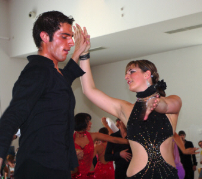

Katrin Ruder und Wolfgang Reyser kamen im Oktober 2005 zum TSC im VfL Sindelfingen. Das allererste Turnier in der Hauptgruppe D-Latein tanzten die beiden im September 2006. Bereits im Januar 2007 stiegen sie in die C-Klasse auf.

Prüfungen und Abitur brachten eine längere Tanzpause mit sich. Die für den Aufstieg erforderlichen Punkte hatte das Paar schon längst gesammelt.

In Limburg tanzten Katrin Ruder und Wolfgang Reyser dann das letzte Turnier in der C-Klasse. Sicher erreichte das Paar die Endrunde. Durch technisch sauberes und musikalisches Tanzen konnten Katrin Ruder und Wolfgang Reyser die Wertungsrichter überzeugen. Mit zweiten Platz ertanzten sie sich die ersehnte letzte Aufstiegsplatzierung.

Christine Richter  
 12.09.2008

