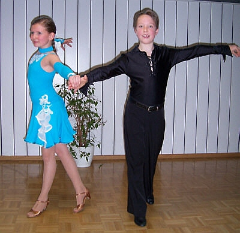

Die Paare des TSC im VfL Sindelfingen starten erfolgreich ins neue Jahr. Katrin Goll und Marc Petersmann tanzen erst seit Oktober 2008 miteinander. Zu ihrem ersten gemeinsamen Turnier ging es nach Stuttgart-Degerloch.

In ihrer Startklasse Junioren I C mussten die beiden sich mit einer starken Konkurrenz aus mehreren Landesverbänden auseinandersetzen. Dies gelang auf Anhieb auch in der Vorrunde ganz hervorragend. In der Endrunde zeigten sie alles. Dafür wurden Katrin Goll und Marc Petersmann am Ende mit dem dritten Platz belohnt.

Monika und Gerhard Winkler sind schon wesentlich länger im Geschäft. Sie eröffneten ihr Tanzsportjahr 2009 mit den Badischen Tanztagen in Karlsruhe. In der Startklasse Senioren III S zeigte das Ehepaar Winkler von Anfang an eine starke tänzerische Leistung. Sicher erreichte es das Finale.

Vor einer großen Zuschauerkulisse und zu guter Musik warten sie noch einmal all ihr Können in die Waagschale. Der fünfte Platz in einem hochkarätig besetzten Starterfeld war gleich zu Beginn des Jahres ein großer Erfolg.

  
Katrin Goll und Marc Petersmann

Christine Richter  
 28.01.2009

