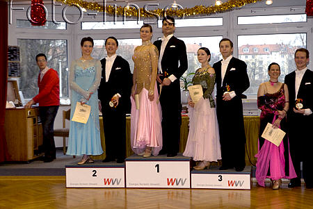

Rita und Thorsten Petersmann machten sich zu ihrem ersten Turnier in 2009 nach Würzburg auf. Dieses Turnier sollte natürlich auch noch der Vorbereitung auf die bald stattfindende Landesmeisterschaft dienen.

Von Anfang an lief alles optimal. Das Paar erreichte fast die maximale Punktzahl und kam natürlich damit ins Finale. Dort ging es dann genauso gut weiter. Die beiden hatten Spaß am Tanzen und zeigten das auch. Damit zogen sie auch das Publikum auf ihre Seite.

Am Ende ertanzten sich Rita und Thorsten Petersmann den zweiten Platz in der Startklasse Senioren I A. Mit dieser Platzierung sind sie wieder ein Stück näher an den Aufstieg in S-Klasse gerückt.

Christine Richter  
 9.2.2009

