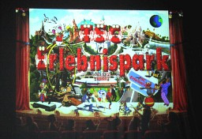
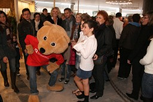
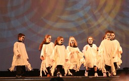
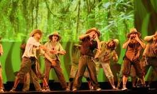
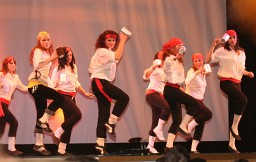

 Der TSC im VfL Sindelfingen lud am 6. und 7. Februar in den „TSC-Erlebnispark“ ein.

Eingestimmt wurde das Publikum bereits im Eingangsbereich. Hier musste man sich durch einen mit Ketten in Schlangenlinien abgesperrten Weg bis zur Kartenkontrolle anstellen. Hinweisschilder wiesen darauf hin, daß man nur noch 60 bzw. 30 Minuten Wartezeit vor sich hatte.

 Im Foyer wurde man dann allerdings erst einmal vom Breunibär mit Bonbons belohnt.

An beiden Tagen begleiteten die jeweils fast 1.000 Zuschauer in der Stadthalle Sindelfingen die Kinder Marc und Nicola zusammen mit ihren Eltern Isabella und Michel von einer Attraktion zu anderen.

Der Weg führte durch eine bunte Mischung von Abenteuerparks wie Disney World oder Tripstrill. Die kleine Familie – dargestellt von Marc Petersmann, Nicola Münz, Isabella Finkbeiner und Michel Dupray – zeigten mit großem schauspielerischen Talent alle Höhen und Tiefen eines Tagesausflugs. Dazu gehörten auch die üblichen Quengeleien wie „ich habe Hunger/Durst“, „ich muss mal“ oder „das ist doch nur etwas für Mädchen“.

 Musikalischer und tänzerischer Auftakt war der Titel „Be our Guest“. Nach und nach erschienen immer mehr Tänzerinnen auf der Bühne, bis am Ende fast 70 die Zuschauer begrüßten. Die ersten Stationen im Park waren ein „Geisterhaus“, ein Besuch bei „Mickey und Minnie Mouse“, „Aladdin“ und „Hercules“. Eine „Putzkolonne“ – bewaffnet mit Eimern und Besen - sorgte zwischendurch für die nötige Sauberkeit. Stimmungsvoll wurde das Musical „König der Löwen“ in Szene gesetzt. Kurz vor der Pause wirbelten dann noch 13 böse „Hexen“ über die Bühne. Auch für das leibliche Wohl war gesorgt. So konnte die Familie im „Irish Pub“ ihren Durst löschen. Für die richtige Stimmung sorgten hier die Stepptänzer des TSC. Auf die Rechnung musste man dann allerdings einige Zeit warten, da diese zum Titel „Type Writer“ tänzerisch erstellt wurde. Später gab es noch eine leckere Mahlzeit im „Restaurante Portugues“. Natürlich hatte man auch an die ach so beliebten Süßigkeiten gedacht und einen „Süßigkeitenstand“ mit Hilfe fetziger Musik dargestellt.

Auch das Publikum konnte sich mit Kaffee und Kuchen stärken. Die von Eltern und Mitwirkenden gestifteten Kuchen wurden in der Pause auf einem großartigen Kuchenbuffet dargeboten.

 Nach der Pause wurde es dann Märchenhaft. Liebevoll und zu einfühlsamer Musik wurden die Märchen „Sterntaler“ und „Spieglein, Spieglein an der Wand“ auf die Bühne gebracht. Die Familie trennte sich dann, um den unterschiedlichen Interessen gerecht zu werden. Mutter und Tochter genossen die tolle Musik von „High School Musical“. Vater und Sohn besuchten „Indiana Jones“, der ein rasantes Fahrgeschäft durch den Urwald symbolisierte. Dies Unternehmen bekam dem Vater Michel nicht allzu gut. Aber Sohnemann Marc wollte noch etwas fahren. Hierzu begleitete ihn die Schwester Nicola. Bei „Rumpelstilzchen“ mit seinen wilden Feuertänzern ging es dann auch richtig zur Sache. Gemeinsam besuchte die Familie dann noch die „Piraten“ auf ihrer Insel.

 Dann war allerdings Eile angesagt, da Mutter Isabella die „Schlussparade“ kurz vor der Schließung des Parks unbedingt noch sehen wollte. Um rechtzeitig zu diesem Ereignis zu kommen, benutzen sie die „Mono-Rail“, wo es dann noch zu einem fingierten Überfall kam. Für die Schlussparade kamen dann noch einmal nach und nach alle Mitwirkenden und Trainer auf die Bühne. Am Ende waren dort mehr als 300 Kinder, Jugendliche und Erwachsene versammelt. Das war dann ein tolles Abschlussbild für eine tolle Show.

Die Jazztanz-Trainerinnen Britta Sigmund, Suzana Köster, Sylvia-Brückner-Lorenz, Claudia Bentele, Maren Reichel und Elisa Porten Madeira und die Stepptanz-Trainer Marita Unsner und Kai Kresse haben mit ihren insgesamt 17 Gruppen ganze Arbeit geleistet und tolle Musik ausgesucht und genauso tolle Choreographien entwickelt. Unterstützt wurden sie beim Bühnenbild vom 2. Vorsitzenden Klaus Richter, der mehr als 100 Hintergrundbilder mit Musik und Text in Einklang gebracht hatte. Hinzu kam aber auch noch die Tonsteuerung und ganz besonders auch die immer zu den einzelnen Szenen passende Beleuchtung, für die das Stadthallenteam zur Verfügung stand.

Dank gilt hier auch den Eltern als Helfer vor und hinter der Bühne und den Sponsoren Kreissparkasse Böblingen, der Löwen- und der Central-Apotheke in Sindelfingen, dem Marriott Hotel und dem Breuningerland Sindelfingen, ohne die dies alles nicht möglich gewesen wäre.

[weitere Bilder hier ..](show-2009.html)

16.02.2009 Christine Richter

