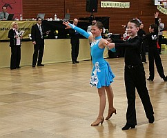
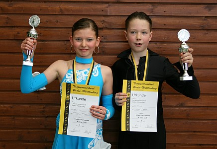

Das jüngste Turnierpaar des TSC im VfL Sindelfingen war gleich bei seiner ersten gemeinsamen Landesmeisterschaft, die in Höfigen ausgetragen wurde, erfolgreich und stand am Ende auf dem Treppchen.

 Katrin Goll und Marc Petersmann gingen in der Startklasse Junioren I C an den Start. In einem recht großen Starterfeld zeigten die beiden von Anfang an hohe tänzerische Qualität und erreichten ganz sicher die Endrunde. Hier überzeugten sie durch rhythmischen und ausdrucksstarkes Tanzen. Dafür wurden sie mit durchweg guten Noten belohnt.

Katrin Goll und Marc Petersmann ertanzten sich den dritten Platz und damit natürlich auch die Bronzemedaille.

Christine Richter  
 23.02.2009

