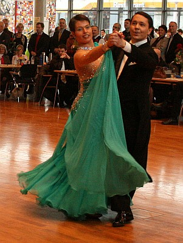

Rita und Thorsten Petersmann machten sich gut vorbereitet auf den Weg zur Landesmeisterschaft. Schon in der Vorrunde konnte das Paar die Wertungsrichter durch eine sehr gute Leistung überzeugen.

Ganz sicher wurde die Endrunde erreicht. Auch hier zeigte es hochklassiges Tanzen. Die Leistungsdichte in der Startklasse Senioren I A-Standard ist aber so hoch, dass es bei den Wertungen ziemlich durcheinander ging. Am Ende verpassten Rita und Thorsten Petersmann mit dem vierten Platz ganz knapp das Siegerpodest.

Christine Richter  
 23.02.2009

