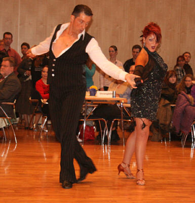

Elena Posadino und Walter Gattler starteten ihre Tanzsportkarriere jeweils mit anderen Tanzpartnern nördlich und südlich von Sindelfingen. Elena Posadino tanzte in Reutlingen und Walter Gattler in Ludwigsburg. Im Jahr 2003 suchten beide neue Tanzpartner und trafen sich dann in Mitte und traten bald darauf für den TSC im VfL Sindelfingen in der Hauptgruppe B-Latein an.

Das Paar trainierte immer bei hochklassigen Trainern wie den 10-Tänze-Weltmeistern Anita Pocz und Neilas Katinas. Walter Gattler reichte das Paartanzen allerdings am Anfang nicht. Er startete außerdem drei Jahre lang in der Lateinformation aus Backnang. Mit dieser Formation stieg er sogar bis in die zweite Bundesliga auf. Dann steckten die beiden ihre ganze Energie in das eigene Training. Trotz einiger beruflich bedingte Unterbrechungen blieben sie immer am Ball.

In der Hauptgruppe II B-Latein sammelten sie fleißig Punkte und Platzierungen. Das Jahr 2008 brachte dann endlich den großen Durchbruch. Elena Posadino und Walter Gattler hatten sich entschieden in der neu eingeführten Startklasse Senioren B-Latein (ab 35 Jahre)an den Start zu gehen. Der Erfolg gab ihnen recht. Gleich im Februar 2008 wurden sie Vizelandesmeister. Danach schwammen sie auf einer wahren Erfolgswelle. Auch innerhalb der jüngeren Konkurrenz der Hauptgruppe II waren sie immer ganz vorne mit dabei. So auch wieder zu Beginn des Jahres 2009, als der Aufstieg in die Startklasse Senioren S-Latein perfekt war. Danach ging es mit Plätzen im Finale weiter. Und dass nicht nur bei den Senioren sondern auch in der Hauptgruppe II A.

So auf höchste motiviert starteten sie auch bei der Landesmeisterschaften Senioren Latein in Freiberg. Wie immer auf ganzer Linie gut vorbereitet, erreichten sie ganz locker die Endrunde. Zwar verpassten sie ganz knapp einen Platz auf dem Siegerpodest. Elena Posadino und Walter Gattler waren mit dem vierten Platz bei ihrer ersten Landesmeisterschaft in der S-Klasse aber vollauf zufrieden.

02.03.2009  Christine Richter

