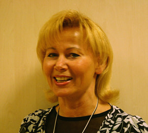

Der TSC im VfL Sindelfingen hat eine neue Trainerin. Zu Beginn des Jahres 2009 hat Dagmar Beck das Turniertraining für den Standardbereich übernommen. Damit konnte der TSC nach Henner Thurau auch dieses Mal wieder eine Landestrainerin verpflichten.

Dagmar Beck blickt bereits jetzt auf eine lange und vor allem erfolgreiche Tanzsportkarriere zurück. Bewegung zur Musik lag ihr schon von Kindesbeinen an im Blut. Bevor sie zusammen mit ihrem jetzigen Ehemann Norman Beck 1980 ihre Tanzsportkarriere startete, gab es bei der Rhythmischen Sportgymnastik schon viele Plätze auf Siegerpodesten.

Das Ehepaar Beck startete in allen Disziplinen, die der Turniertanzsport zu bieten hat. In Standard, Latein, zehn Tänze und auch mit der A-Formation (Standard) des 1. TC Ludwigsburg waren sie immer ganz vorne mit dabei. Sie tanzten sowohl im Amateur- als auch im Profilager von Titel zu Titel. Mit der Formation wurden mehrfach Europa- und Weltmeister.

Bereits seit 1989 gibt Dagmar Beck ihr Wissen als Trainerin weiter. Auf diesem Gebiet, so gibt sie zu, ist sie manchmal etwas ungeduldig. Allerdings würde sie von den Paaren nie mehr verlangen als von sich selbst. Die Paare des TSC im VfL Sindelfingen freuen sich, dass sie mit einer solchen Trainerin zusammenarbeiten können.

Schön wäre es wenn sich noch einige Mitstreiter finden würden. Der TSC bietet für den Tanzturniersport in den eigenen Räumen sehr gute Trainingsmöglichkeit.

Gruppentraining wird wöchentlich angeboten:   
 Mittwoch Standard bei Dagmar Beck,   
 Latein Dienstag bei Anita Pocz und Rolandas Trembo (im Wechsel).   
 Außerdem stehen für das freie Training täglich zwei Säle fast rund um die Uhr zur Verfügung.

Wenn Sie noch Fragen haben, rufen Sie uns an: 07034/22219 oder – E-Mail:kontakt@tanzsportclub.vfl-Sindelfingen.de.

Christine Richter  
 25.03.2009

