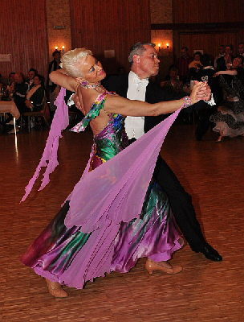

Monika und Gerhard Winkler machten sich auf den weiten Weg nach Heiligenhafen an der Ostsee, um dort gleich zwei Turniere der Startklasse Senioren III S zu tanzen.

Am Samstag den 11. April lief es unter dem Motto "Die Ostsee tanzt". Am Sonntag ging es um die Qualifikation im Rahmen der "Goldenen 55" für die Paare ab 55 Jahre. Beide Turniere fanden im Kursaal direkt am Meer statt. Hier passte wirklich alles: das Ambiente, die Musik und auch die Stimmung war toll.

Bereits für das "normale" Turnier am Samstag waren 25 Paare angereist. Aus dem Süden (Baden-Württemberg)waren am Samstag drei und am Sonntag vier Paare dabei. Winklers waren am ersten Tag supergut drauf und kamen wie erhofft ins Finale und wurden dort Fünfte. Nach diesen vier wirklich harten Runden waren sie leider am Sonntag nicht mehr ganz so frisch. Daher erreichten sie im dem Starterfeld von 44 Paaren leider nur das Viertelfinale. Trotzdem waren Monika und Gerhard Winkler mit dem Tanzwochenende im hohen Norden zufrieden.

Christine Richter  
 28.04.2009

