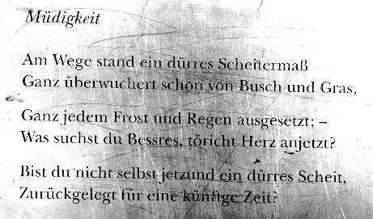
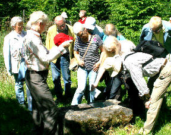
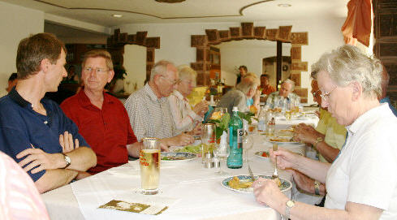

Der TSC im VfL Sindelfingen begab sich einmal nicht auf das Parkett sondern auf die Spuren von Christian Wagner (1835 – 1918). Die Wanderer trafen sich in Warmbronn, dem Heimatdorf des Dichters.

 Zuerst wurde das Geburtshaus, in dem er auch sein ganzes Leben verbrachte, besichtigt. Ein kundiger Führer berichtete über das Leben und das Werk von Christian Wagner, der in seinem Dorf immer als Sonderling galt. Er war Bauer, Tagelöhner, Ehemann, Vater und Dichter. Seine besondere Liebe galt der Natur. So setzte er sich schon damals stark für Natur- und Tierschutz ein, was sein Umfeld mit großer Verwunderung betrachtete. Diese Liebe zur Natur spiegelt sich auch in vielen seiner Gedichte wieder.

  
 Nach dem Museumsbesuch nahmen wir den Christian-Wagner-Dichterpfad unter die Füße. Dabei handelt es sich um einen Rundwanderweg um den Ort Warmbronn, auf dem insgesamt elf Steine mit Gedichttafeln zum Verweilen und Lesen einladen. Dieser Weg ist auch noch aus einem anderen Grund sehr abwechslungsreich. Er führt durch Wiesen, Felder, Wald und am Warmbronner See vorbei.

  
 Nach gut drei Stunden geistiger und sportlicher Betätigung kam das leibliche Wohl zu seinem Recht. Zum Abschluss saß die Gruppe bei gutem Essen noch eine ganze Weile beisammen.

Christine Richter  
 19.05.2009

